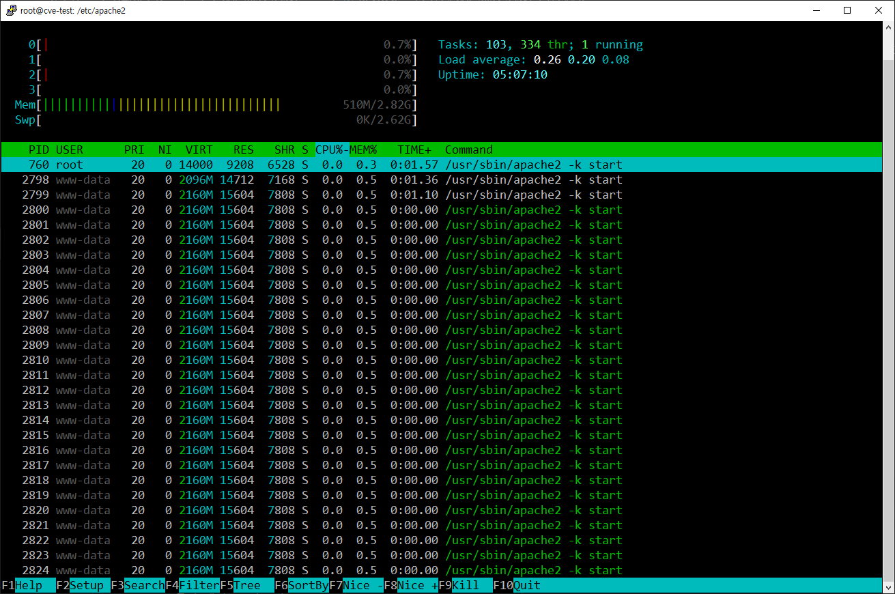

# CVE-2024-27316
{: .no_toc }

Apache 서버 메모리 고갈 취약점
{: .fs-6 .fw-300 }

[NVD][NVD]{: .btn .fs-5 .mb-4 .mb-md-0 }
[Apache][Apache]{: .btn .fs-5 .mb-4 .mb-md-0 }

1. TOC
{:toc}

--- 

## 취약점 요약
HTTP/2 프로토콜에서 사용자가 제한을 초과하는 헤더를 지속적으로 전송할 때 nghttp2 라이브러리가 이를 임시로 메모리에 버퍼링하여 메모리 고갈을 초래할 수 있는 취약점

## 취약 대상
Apache HTTP Server 2.4.17 ~ 2.4.58 버전

## 공격 원리
- Apache Server에서 일정 크기를 초과하는 헤더에 대해 HTTP 413 응답을 생성 
- 초과된 헤더는 HPACK으로 압축된 후 nghttp2 라이브러리 내부의 메모리 버퍼에 임시로 저장
- 저장된 헤더는 다음 패킷이 처리될 때까지 유지
- 공격자는 이 취약점을 악용하여 서버에 지속적으로 초과된 길이의 HTTP/2 헤더를 전송 
- 서버는 메모리 소진으로 인해 서비스 중단 


---

## 환경 구성
- Victim: Ubuntu 22.0.4 (IP: 192.168.10.128)
- Attacker: Windows11 (IP: 192.168.9.1)

## 환경 구축
Apache Server v2.4.52 설치 및 http2 프로토콜 사용 설정
```bash
## Apache 2.4.52 설치 및 환경설정
sudo apt install apache2=2.4.52*
sudo apt install libnghttp2-dev

sudo a2enmod ssl
sudo a2enmod http2
sudo a2ensite default-ssl
sudo ufw allow 80/tcp
sudo ufw allow 8080/tcp
sudo ufw allow 443/tcp

sudo systemctl restart apache2

sudo vi /etc/apache2/sites-available/default-ssl.conf

## default.ssl 설정 - [HTTP2, HTTP 1.1 프로토콜 사용]
<IfModule mod_ssl.c>
    <VirtualHost _default_:443>
        ServerAdmin webmaster@localhost
        DocumentRoot /var/www/html

        SSLEngine on
        SSLCertificateFile /etc/ssl/certs/apache-selfsigned.crt
        SSLCertificateKeyFile /etc/ssl/private/apache-selfsigned.key

        <FilesMatch "\.(cgi|shtml|phtml|php)$">
            SSLOptions +StdEnvVars
        </FilesMatch>
        <Directory /usr/lib/cgi-bin>
            SSLOptions +StdEnvVars
        </Directory>

        Protocols h2 http/1.1
        ErrorLog ${APACHE_LOG_DIR}/error.log
        CustomLog ${APACHE_LOG_DIR}/access.log combined
    </VirtualHost>
</IfModule>

sudo systemctl restart apache2

sudo vi /etc/apache2/apache2.conf

## apache2.conf 설정 - 취약점 설정[requests 헤더 사이즈에 대한 limit를 늘림]
LimitRequestFieldSize 16384
LimitRequestFields 1000
```

<br>구현 된 홈페이지 (192.168.56.1:443)


## 공격 재현
- Python Version : 3.12.3
- Module : hpack, threading, h2, socket, ssl

```py
import 
```

## Apache 서버 DoS 공격 전후 시스템 상태 분석
- Apache2 시스템 상태 모니터링
```bash
htop -p $(pgrep apache2 | tr '\n' ',')
```

- DoS 공격 실행 전, CPU, 메모리 사용량이 안정적으로 유지 (평균 : 13.200 MB)


- 지속적인 공격이나 높은 부하로 인해 서버의 자원이 고갈되면 프로세스가 비정상적으로 종료


---
[NVD]: https://nvd.nist.gov/vuln/detail/CVE-2024-27316
[Apache]: https://httpd.apache.org/security/vulnerabilities_24.html

[nvd api Docs]: https://nvd.nist.gov/developers/vulnerabilities
