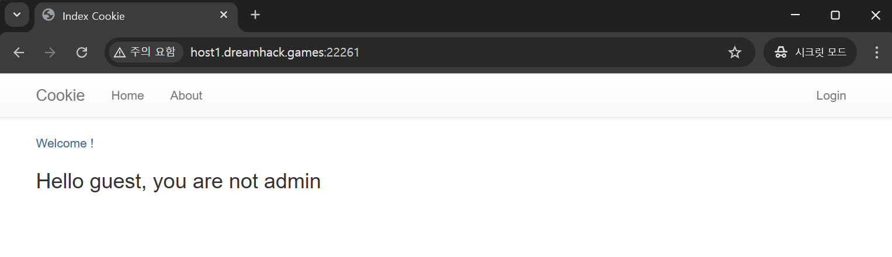
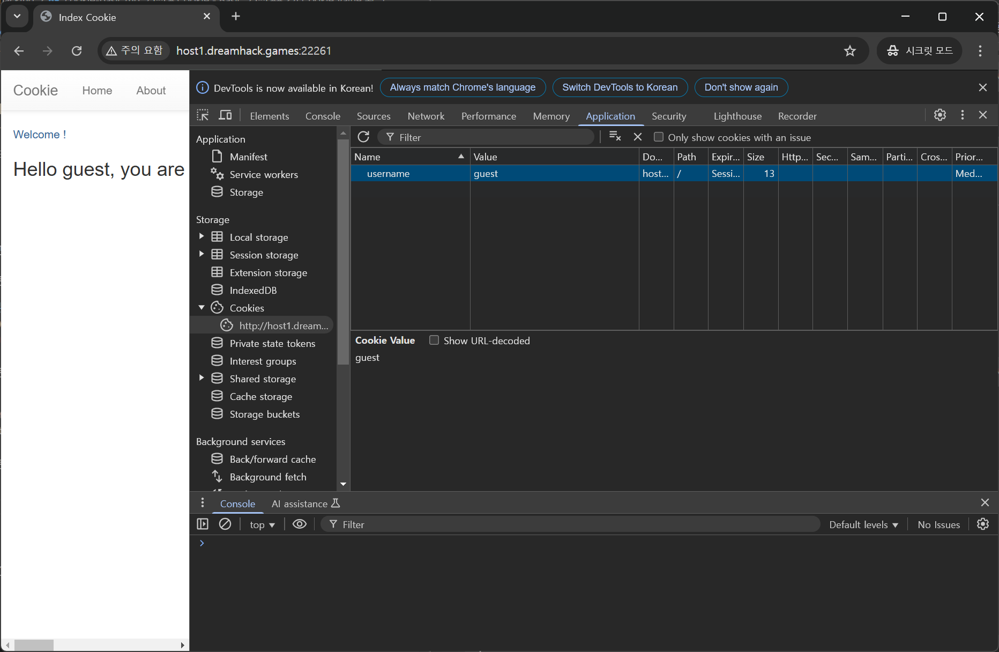
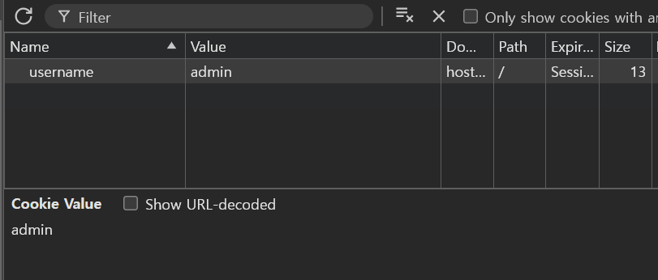
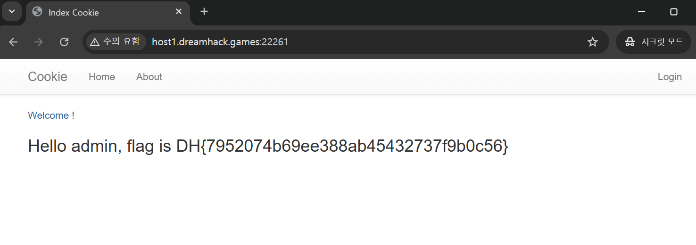

# Cookie - 1
{: .no_toc}

Webhacking Wargame - Cookie 1
{: .fs-6 .fw-300 }

[Dreanhack][dreamhack]{: .btn .fs-5 .mb-4 .mb-md-0 target="_blank"}

---

1. TOC
{:toc}

---

## 문제
- 쿠키로 인증 상태를 관리하는 간단한 로그인 서비스입니다.
- admin 계정으로 로그인에 성공하면 플래그를 획득할 수 있습니다.

## 도구
- Google Chrome

---

## 1.1 문제 해결 전략 - Cookie
- Cookie Manipulation : Base64로 인코딩된 값을 디코딩/변조, JWT 토큰 조작 하는 전략
- Cookie Theft : XSS 공격으로 document.cookie를 이용해 Cookie를 탈취하는 전략
- Session Hijacking : 쿠키 값이 고정되어 있어서 다른 사용자의 세션을 가로채는 전략

{: .no_toc}
> - Base64 : 바이너리 데이터를 텍스트 형식으로 변환하는 인코딩 방식
> - JWT : 사용자의 인증 정보를 안전하게 전달하기 위한 토큰 형식
> - XSS : 웹사이트에서 악성 스크립트를 삽입하는 공격 기법
> - `document.cookie` : 브라우저에서 쿠키 정보를 읽거나 설정할 수 있는 Javascript 객체

---

## 2.1 웹사이트 접속
- 해당 문제의 웹사이트 접속
- link : http://host1.dreamhack.games:18643/

- 

## 2.2 웹사이트 HTML 요소 분석
- 개발자 도구(Elements 패널) 활용하여 HTML 코드 분석
- default 계정이 guest / guest 임을 확인

- 

## 2.3 Guest Login
- login 페이지에서 `id:Guest`, `paaswd:Guest`로 로그인
- 로그인 성공 시 Hello guest, you are not admin 메시지 출력

- 

## 2.4 Cookie 값 확인
- `F12` 또는 `Ctrl + Shift + I`로 개발자 도구 열기
- Application의 Storage에서 Cookies 선택
- Guest Cookie 확인 (Name:`username`, Value:`Guest`)

- 

## 2.5 Cookie 값 변조
- 해당 Guest Cookie Value 값 변경
- `Value`:`admin`

- 

## 2.6 페이지 새로고침 후 동작 확인
- 변경된 쿠키 값이 적용되었는지 확인
- `Hello admin, flag is DH{7952074b69ee388ab45432737f9b0c56}` 메시지 출력
- 관리자 권한을 획득했으며, flag가 정상적으로 노출

- 

---

[dreamhack]: https://dreamhack.io/wargame/challenges/6