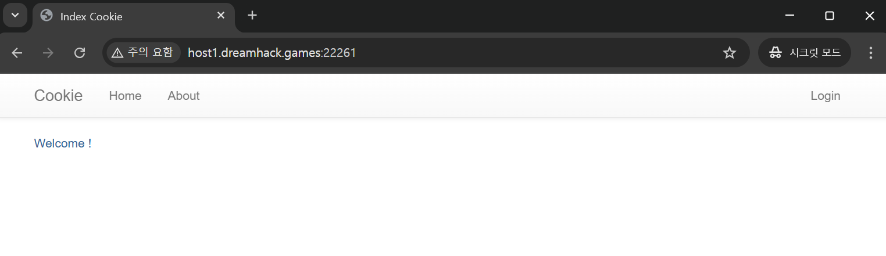

# Cookie - Basic
{: .no_toc}

Cookie Basic Wargane
{: .fs-6 .fw-300 }

[Dreanhack][dreamhack]{: .btn .fs-5 .mb-4 .mb-md-0 target="_blank"}

---

1. TOC
{:toc}

---

## 문제
- 쿠키로 인증 상태를 관리하는 간단한 로그인 서비스입니다.
- admin 계정으로 로그인에 성공하면 플래그를 획득할 수 있습니다.

## 도구
- OllyDbg 64-bit

{: .no_toc}
> - 

---

## 1.1 문제 해결 전략 - Cookie
- Cookie Manipulation : Base64로 인코딩된 값을 디코딩/변조, JWT 토큰 조작 하는 전략
- Cookie Theft : XSS 공격으로 document.cookie를 이용해 Cookie를 탈취하는 전략
- Session Hijacking : 쿠키 값이 고정되어 있어서 다른 사용자의 세션을 가로채는 전략

---

## 2.1 웹사이트 접속
- 해당 문제의 웹사이트 접속
- link : http://host1.dreamhack.games:18643/

- 

## 2.2 웹사이트 HTML 요소 분석
- 개발자 도구(Elements 패널) 활용하여 HTML 코드 분석
- default 계정이 guest / guest 임을 확인

- 

---

[dreamhack]: https://dreamhack.io/wargame/challenges/6