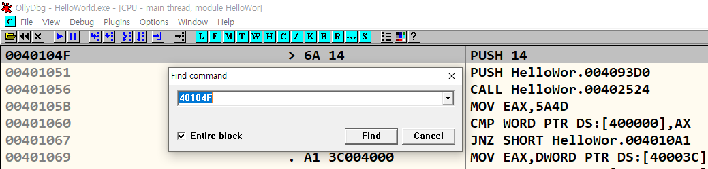

# Hello World! 리버싱
"Hello World!" 프로그램을 디버깅
{: .fs-6 .fw-300 }

---

## 실습 목표
- HelloWold.exe 실행 파일을 디버깅하여 어셈블리 언어로 변환 된 main() 함수 찾기.
- 찾는 과정을 통해서 기본적인 디버거의 사용법과 어셈블리 명령어에 대해 실습
- 디버거를 이용해서 프로그램의 내용을 간단히 패치하는 실습

---

## 1.0 Hello World! 프로그램 (32bit)
- Visual C++를 이용해 C 언어 HelloWorld.cpp를 빌드
- 소스코드는 Windows API를 사용하여 "Hello World!"가 담긴 MessageBox 출력
- HelloWorld.cpp 빌드 후, 실행 파일(HelloWorld.exe) 생성


```cpp
#include "windows.h"
#include "tchar.h"

int _tmain(int argc, TCHAR *argv[])
{
	MessageBox(NULL, 
			   L"Hello World!", 
			   L"www.reversecore.com", 
			   MB_OK);
	
	return 0;
}
```

## 1.1 HelloWorld.exe 디버깅 
- HelloWorld.exe 파일을 OllyDbg(32bit)로 열기

{: .note-title }
> **OllyDbg**는 Windows 환경에서 동작하는 **디버거(Debugger)**로, 주로 어셈블리 언어 수준에서 프로그램의 실행을 분석하는 데 사용
> [OllyDbg](https://www.ollydbg.de/)

- 디버거가 멈춘 곳은 EP(EntryPoint) 코드로, HelloWorld.exe의 실행 시작 주소
- 시작 주소는 **4011A0**, CALL, JMP 명령어가 존재

{: .note-title }
> **JMP**는 무조건적인 점프 명령어로, 프로그램의 흐름을 지정된 위치로 이동, **CALL**은 특정 함수를 호출하는 명령어


## 1.2 프로그램 구성 요소
- EP : Windows 실행 파일(EXE, DLL, SYS 등)의 코드 시작점
- Address(**004011A0**) : 프로세스의 가상 메모리(Virtual Address:VA) 내의 주소
- Instruction(**E8 67150000**) : IA32(또는 x86) CPU 명령어
- Disassembled code(**CALL HelloWor.0040270C**) : OP Code를 보기 쉽게 어셈블리로 변환한 코드
- comment : 디버거에서 추가한 주석

{: .note-title }
> **EP**란 , 프로그램이 실행될때 CPU에 의해 가장 먼저 실행되는 코드 시작 위치

---

## 1.3 **JMP HelloWor.40104F** 실행
- **JMP HelloWor.40104F** 명령을 실행하면, **40104F** 주소로 이동
- **401056** 주소의 CALL 402524 함수 호출 명령어 확인
- 명령어 실행 후, 함수 내부 확인


## 1.4 Win32 API 호출 코드
- F7,F8 명령으로 디버깅을 진행하면, **4010E4** 주소 확인
- **CALL <JMP.&KERNEL32.GetCommandLineW>** 명령어는 Win32 API 호출 코드


## 1.4 어셈블리 언어로 변환 된 main() 함수 찾기
- 계속 디버깅을 진행하면, **401144** 주소 확인 후 명령어 실행해서 함수 내부 확인


- MessageBoXW() API 호출하는 코드 확인
- 그 API의 파라미터가 "www.reverse.core.com"과 "Hello World!" 문자열
- HelloWorld.cpp의 소스코드와 일치하기 때문에 **401000** 함수가 바로 main() 함수


---

## 2.1 디버거 동장 명령(Code Window에서 동작) 요약

| 명령어                    | 단축키       | 설명                                                                 |
|----------------------------|--------------|----------------------------------------------------------------------|
| Go to                      | Ctrl+G       | 원하는 주소로 이동(코드/메모리를 확인할 때 사용. 실행되는 것은 아님)  |
| Execute till Cursor         | F4           | 커서 위치까지 실행(디버깅하고 싶은 주소까지 바로 갈 수 있음)           |
| Comment                     | ;            | Comment 추가                                                         |
| User-defined comment        | 마우스 우측 메뉴 | search for user-defined comment                                       |
| Label                       | :            | Label 추가                                                           |
| User-defined label          | 마우스 우측 메뉴 | search for user-defined label                                         |
| Set/Reset BreakPoint        | F2           | BP 설정/해제                                                         |
| Run                         | F9           | 실행(BP가 걸려있으면 그곳에서 실행이 정지됨)                         |
| Show the current EIP        | *            | 현재 EIP 위치를 보여줍니다.                                           |
| Show the previous Cursor    | -            | 직전 커서 위치를 다시 보여줍니다.                                     |
| Preview CALL/JMP address    | Enter        | 커서가 CALL/JMP 등의 명령어에 위치해 있다면 해당 주소를 따라가서 보여줌 (실행되는 것이 아님, 간단히 함수 내용을 확인할 때 사용) |

{: .no_toc}
> **EIP(Extended Instruction Pointer)**는 CPU가 현재 실행하고 있는 명령어의 메모리 주소를 가리키는 레지스터이다. 주로 x86 아키텍처에서 사용되며, 프로그램의 실행 흐름을 관리하는 중요한 역할을 한다.

## 2.1 Basecamp
- 베이스캠프는 리버스 엔지니어들이 디버깅을 진행하면서 중간중간 코드에서 분석을 원하는 중요 포인트(주소)를 지정해 놓은 후 그 포인트로 빠르게 갈 수 있는 방법을 기록해 두는 방법이다.
- 베이스캠프를 설치하는 4가지 방법으로는 **Goto 명령**, **BP 설치**, **주석**, **레이블** 등 이 있다.

## 2.2 Goto 명령
- **HelloWorld.exe**를 디버깅하고, 40104F 주소를 베이스캠프로 설정
- Go to`[Ctrl+G]` 다이얼로그에 40104F 주소 입력

