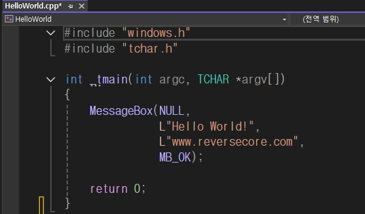
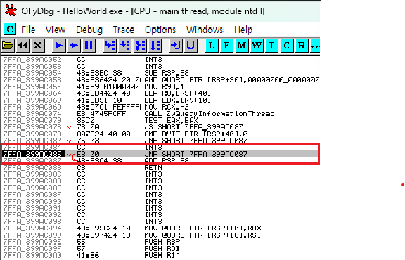
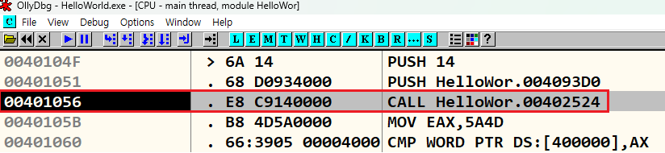
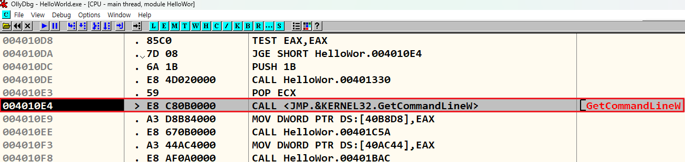
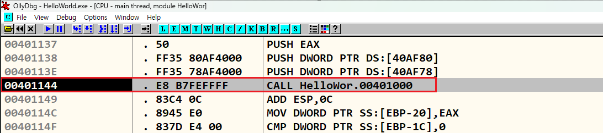
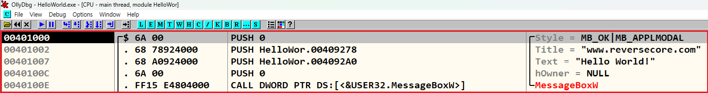

# Hello World! 리버싱
"Hello World!" 프로그램을 디버깅
{: .fs-6 .fw-300 }

---

## 실습 목표
- HelloWold.exe 실행 파일을 디버깅하여 어셈블리 언어로 변환 된 main() 함수 찾기.
- 찾는 과정을 통해서 기본적인 디버거의 사용법과 어셈블리 명령어에 대해 실습

## 1.0 Hello World! 프로그램 (32bit)
- Visual C++를 이용해 C 언어 HelloWorld.cpp를 빌드
- 소스코드는 Windows API를 사용하여 "Hello World!"가 담긴 MessageBox 출력
- HelloWorld.cpp 빌드 후, 실행 파일(HelloWorld.exe) 생성



```cpp
#include "windows.h"
#include "tchar.h"

int _tmain(int argc, TCHAR *argv[])
{
	MessageBox(NULL, 
			   L"Hello World!", 
			   L"www.reversecore.com", 
			   MB_OK);
	
	return 0;
}
```

## 1.1 HelloWorld.exe 디버깅 
- HelloWorld.exe 파일을 OllyDbg(32bit)로 열기

{: .note-title }
> **OllyDbg**는 Windows 환경에서 동작하는 **디버거(Debugger)**로, 주로 어셈블리 언어 수준에서 프로그램의 실행을 분석하는 데 사용
> [OllyDbg](https://www.ollydbg.de/)

- 디버거가 멈춘 곳은 EP(EntryPoint) 코드로, HelloWorld.exe의 실행 시작 주소
- 시작 주소는 **4011A0**, CALL, JMP 명령어가 존재

{: .note-title }
> **JMP**는 무조건적인 점프 명령어로, 프로그램의 흐름을 지정된 위치로 이동, **CALL**은 특정 함수를 호출하는 명령어



## 1.2 프로그램 구성 요소
- EP : Windows 실행 파일(EXE, DLL, SYS 등)의 코드 시작점
- Address(**004011A0**) : 프로세스의 가상 메모리(Virtual Address:VA) 내의 주소
- Instruction(**E8 67150000**) : IA32(또는 x86) CPU 명령어
- Disassembled code(**CALL HelloWor.0040270C**) : OP Code를 보기 쉽게 어셈블리로 변환한 코드
- comment : 디버거에서 추가한 주석

{: .note-title }
> **EP**란 , 프로그램이 실행될때 CPU에 의해 가장 먼저 실행되는 코드 시작 위치

---

## 1.3 **JMP HelloWor.40104F** 실행
- **JMP HelloWor.40104F** 명령을 실행하면, **40104F** 주소로 이동
- **401056** 주소의 CALL 402524 함수 호출 명령어 확인
- 명령어 실행 후, 함수 내부 확인




## 1.4 Win32 API 호출 코드
- F7,F8 명령으로 디버깅을 진행하면, **4010E4** 주소 확인
- **CALL <JMP.&KERNEL32.GetCommandLineW>** 명령어는 Win32 API 호출 코드



## 1.4 어셈블리 언어로 변환 된 main() 함수 찾기
- 계속 디버깅을 진행하면, **401144** 주소 확인 후 명령어 실행해서 함수 내부 확인



- MessageBoXW() API 호출하는 코드 확인
- 그 API의 파라미터가 "www.reverse.core.com"과 "Hello World!" 문자열
- HelloWorld.cpp의 소스코드와 일치하기 때문에 **401000** 함수가 바로 main() 함수



---
