# Hello World! 리버싱
"Hello World!" 프로그램을 디버깅
{: .fs-6 .fw-300 }

---

## 실습 목표
- HelloWold.exe 실행 파일을 디버깅하여 어셈블리 언어로 변환 된 main() 함수 찾기.
- 찾는 과정을 통해서 기본적인 디버거의 사용법과 어셈블리 명령어에 대해 실습
- 디버거를 이용해서 프로그램의 내용을 간단히 패치하는 실습

---

## 1.0 Hello World! 프로그램 (32bit)
- Visual C++를 이용해 C 언어 HelloWorld.cpp를 빌드
- 소스코드는 Windows API를 사용하여 "Hello World!"가 담긴 MessageBox 출력
- HelloWorld.cpp 빌드 후, 실행 파일(HelloWorld.exe) 생성


```cpp
#include "windows.h"
#include "tchar.h"

int _tmain(int argc, TCHAR *argv[])
{
	MessageBox(NULL, 
			   L"Hello World!", 
			   L"www.reversecore.com", 
			   MB_OK);
	
	return 0;
}
```

## 1.1 HelloWorld.exe 디버깅 
- HelloWorld.exe 파일을 OllyDbg(32bit)로 열기

{: .note-title }
> **OllyDbg**는 Windows 환경에서 동작하는 **디버거(Debugger)**로, 주로 어셈블리 언어 수준에서 프로그램의 실행을 분석하는 데 사용
> [OllyDbg](https://www.ollydbg.de/)

- 디버거가 멈춘 곳은 EP(EntryPoint) 코드로, HelloWorld.exe의 실행 시작 주소
- 시작 주소는 **4011A0**, CALL, JMP 명령어가 존재

{: .note-title }
> **JMP**는 무조건적인 점프 명령어로, 프로그램의 흐름을 지정된 위치로 이동, **CALL**은 특정 함수를 호출하는 명령어


## 1.2 프로그램 구성 요소
- EP : Windows 실행 파일(EXE, DLL, SYS 등)의 코드 시작점
- Address(**004011A0**) : 프로세스의 가상 메모리(Virtual Address:VA) 내의 주소
- Instruction(**E8 67150000**) : IA32(또는 x86) CPU 명령어
- Disassembled code(**CALL HelloWor.0040270C**) : OP Code를 보기 쉽게 어셈블리로 변환한 코드
- comment : 디버거에서 추가한 주석

{: .note-title }
> **EP**란 , 프로그램이 실행될때 CPU에 의해 가장 먼저 실행되는 코드 시작 위치

---

## 1.3 **JMP HelloWor.40104F** 실행
- **JMP HelloWor.40104F** 명령을 실행하면, **40104F** 주소로 이동
- **401056** 주소의 CALL 402524 함수 호출 명령어 확인
- 명령어 실행 후, 함수 내부 확인


## 1.4 Win32 API 호출 코드
- F7,F8 명령으로 디버깅을 진행하면, **4010E4** 주소 확인
- **CALL <JMP.&KERNEL32.GetCommandLineW>** 명령어는 Win32 API 호출 코드


## 1.4 어셈블리 언어로 변환 된 main() 함수 찾기
- 계속 디버깅을 진행하면, **401144** 주소 확인 후 명령어 실행해서 함수 내부 확인


- MessageBoXW() API 호출하는 코드 확인
- 그 API의 파라미터가 "www.reverse.core.com"과 "Hello World!" 문자열
- HelloWorld.cpp의 소스코드와 일치하기 때문에 **401000** 함수가 바로 main() 함수


---

## 2.1 디버거 동장 명령(Code Window에서 동작) 요약

| 명령어                    | 단축키       | 설명                                                                 |
|----------------------------|--------------|----------------------------------------------------------------------|
| Go to                      | Ctrl+G       | 원하는 주소로 이동(코드/메모리를 확인할 때 사용. 실행되는 것은 아님)  |
| Execute till Cursor         | F4           | 커서 위치까지 실행(디버깅하고 싶은 주소까지 바로 갈 수 있음)           |
| Comment                     | ;            | Comment 추가                                                         |
| User-defined comment        | 마우스 우측 메뉴 | search for user-defined comment                                       |
| Label                       | :            | Label 추가                                                           |
| User-defined label          | 마우스 우측 메뉴 | search for user-defined label                                         |
| Set/Reset BreakPoint        | F2           | BP 설정/해제                                                         |
| Run                         | F9           | 실행(BP가 걸려있으면 그곳에서 실행이 정지됨)                         |
| Show the current EIP        | *            | 현재 EIP 위치를 보여줍니다.                                           |
| Show the previous Cursor    | -            | 직전 커서 위치를 다시 보여줍니다.                                     |
| Preview CALL/JMP address    | Enter        | 커서가 CALL/JMP 등의 명령어에 위치해 있다면 해당 주소를 따라가서 보여줌 (실행되는 것이 아님, 간단히 함수 내용을 확인할 때 사용) |

{: .no_toc}
> **EIP(Extended Instruction Pointer)**는 CPU가 현재 실행하고 있는 명령어의 메모리 주소를 가리키는 레지스터이다. 주로 x86 아키텍처에서 사용되며, 프로그램의 실행 흐름을 관리하는 중요한 역할을 한다.

## 2.1 Basecamp
- 베이스캠프는 리버스 엔지니어들이 디버깅을 진행하면서 중간중간 코드에서 분석을 원하는 중요 포인트(주소)를 지정해 놓은 후 그 포인트로 빠르게 갈 수 있는 방법을 기록해 두는 방법이다.
- 베이스캠프를 설치하는 4가지 방법으로는 **Goto 명령**, **BP 설치**, **주석**, **레이블** 등 이 있다.

## 2.2 Goto 명령
- **HelloWorld.exe**를 디버깅하고, 40104F 주소를 베이스캠프로 설정
- Go to[Ctrl+G] 다이얼로그에 40104F 주소 입력


## 2.3 BP 설치
- 베이스캠프로 가는 또 다른 방법은 BP(Break Point)를 설치[F2], 하고 실행[F9]하는 것이다.
- 디버거는 현재 실행 위치에서부터 프로세스를 실행하다가 BP가 걸린 곳에서 멈추게 된다.

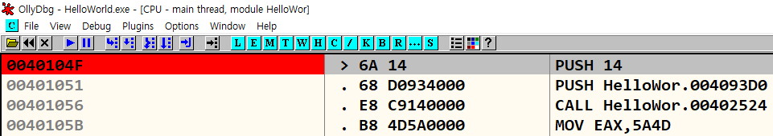

{: .no_toc}
> - 메인 메뉴의 View - Breakpoints를 선택(단축키 [ALT+B])하면, BreakPoints 목록이 나타남.
> - 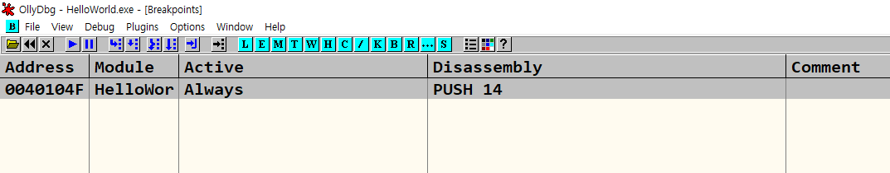

## 2.4 주석
- [;] 단축키로 주석(Comment)을 달고, 주석을 찾아 가는 방법

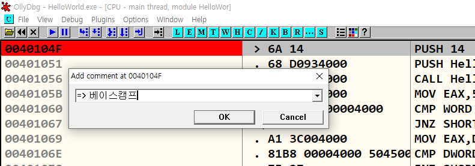

{: .no_toc}
> - 마우스 우측 메뉴의 Search for-User-defined comment 항목을 선택하면, 사용자가 입력한 주석들이 표시가 됨
> - 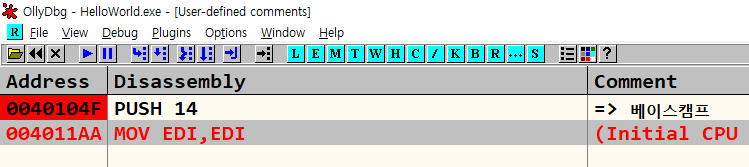

## 2.5 레이블
- 레이블(Lable)은 원하는 주소에 특정 이름을 붙여주는 기능
- 40104F 주소에 커서를 위치시킨 후 단축키 [:]를 이용해 레이블을 입력

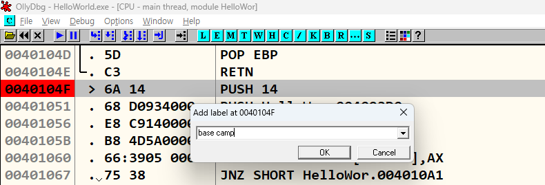

{: .no_toc}
> - 4011A5 주소에 40104F 주소를 해당 레이블로 표시
> - 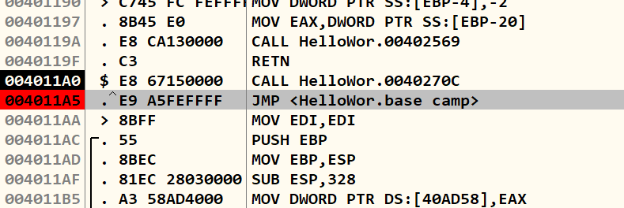
> <br>
> - 레이블도 주석과 마찬가지로 검색이 가능
> - 마우스 우측 메뉴의 'Search for - User defined labels' (Initial CPU selection이라고 표시된 부분은 현재 커서 위치를 나타냄)
> - 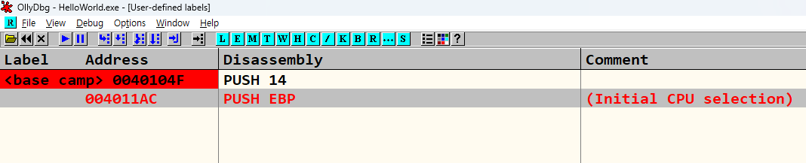

---

## 3.1 원하는 코드 빨리 찾아내는 4가지 방법
- Hello World.exe 프로그램이 "Hello World!" 메시지 박스를 출력한다는 것을 이미 알고 있다.
- Win32 API 개발자들이라면 MessageBox() API 함수가 머릿속에 떠오를 것이다.
- 이렇게 프로그램의 기능이 명확한 경우는 그냥 실행만 해봐도 내부 구조를 대략적으로 추측할 수 있다.

## 3.2 코드 실행 방법
- 코드 실행 방법의 원리는 아래와 같다.
- 필요한 코드는 main() 함수의 MessageBox() 함수 호출 코드
- HelloWorld.exe를 디버깅하다 보면, 언젠가 main()함수의 MessageBox()함수가 실행되어 "Heelo World!" 메시지 박스가 출력된다.

## 3.3 코드 실행 실습
- 베이스캠프(40104F)에서부터 명령어를 한 줄씩 실행[F8]한다.
- 몇 번 반복해보면 특정 함수를 호출한 이후에 메시지 박스가 나타나는 것을 파악할 수 있음
- 바로 그 함수가 main() 함수이다.
- 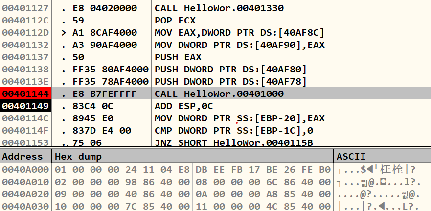

{: .no_toc}
> - 40114 주소에 있는 CALL 00401000 명령어에서 호출하는 함수 주소(401000)로 가보면(Step Into[F7]), main() 함수의 코드 영역
> - 401002와 401007 주소의 PUSH 명령어는 메시지 박스에 표시될 문자열을 스택(Stack)에 저장하여 MessageBoxW() 함수에 파라미터로 전달
> - 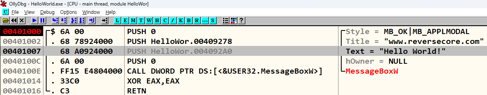 

## 3.4 문자열 검색 방법
- OllyDbg가 디버깅할 프로그램을 처음 로딩할 때 사전 분석 과정을 거침.
- 프로세스 메모리를 훑어서 참조되는 문자열과 호출되는 API들을 뽑아내서 따로 목록으로 정리
- 마우스 우측 메뉴 - Search for - All referenced text strings
- 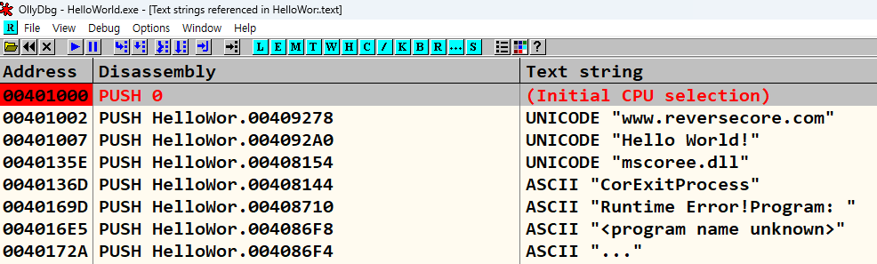 

{: .no_toc}
> - 401007 주소의 PUSH 004092A0 명령어가 있는데, 이 명령어에서 참조되는 4092A0 주소에 있는 문자열의 확인을 위하여 OllyDbg의 덤프(Dump) 창에서 확인
> - 유니코드(UniCode)로 된 "Hello World!" 문자열 확인
> - 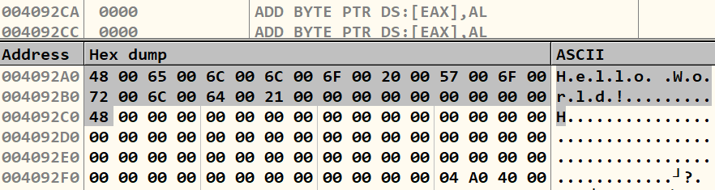 
 
## 3.5 API 검색 방법 - 1
- Windows 프로그래밍에서 모니터 화면에 뭔가를 출력하려면 Win32 API를 사용하여 OS에게 화면 출력을 요청해야 함.
- 따라서 프로그램의 기능을 보고 사용되었을 법한 Win32 API 호출을 예상하여, 그 부분을 찾을 수 있다면, 디버깅이 매우 간편
- 코드에에서 사용된 API 호출 목록만 보고 싶을 때는 **All intermodular calls** 명령을 사용.
- 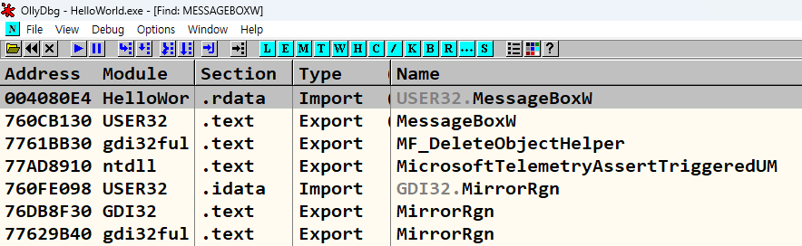 

## 3.6 API 검색 방법 - 2
- Packer/Protector를 사용하여 실행 파일을 압축(또는 보호)해버리면, 파일 구조가 변경되어 OllyDbg에서 API 호출 목록이 보이지 않는다.
- 이런 경우에는 프로세스 메모리에 로딩된 라이브러리에 직접 BP를 걸어 보는 것이다.
- 실제로 API는 C:\Windows\system32 폴더에 *.dll 파일 내부에 구현되어 있다.
- View - Memory 메뉴를 선택 (단축키 [Alt+M])
- 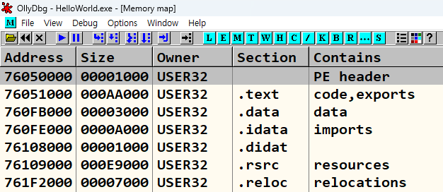 

<br>

- **Name in all modules** 명령을 사용하고, 나타나는 창에서 **Name** 으로 정렬시키고, **MessageBoxW**를 타이핑
- USER32 모듈에서 Export type의 MessageBoxW 함수를 선택
- 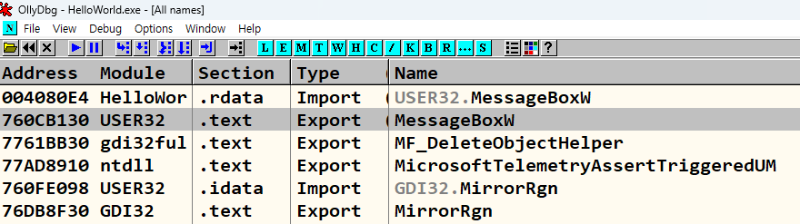 


