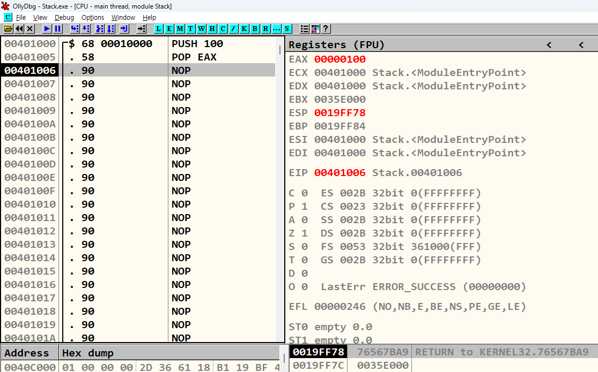

# abex' crackme #1 분석
{: .no_toc}

간단한 crackme 샘플을 분석 및 실습
{: .fs-6 .fw-300 }

---

1. TOC
{:toc}

---

## 실습 목표
- abex' crackme #1 분석하여 디버거와 디스어셈 코드에 적응

---

## 1.1 abex' crackme #1
- 디버깅을 시작하기 전에 먼저 파일을 실행시켜서 어떤 프로그램인지 확인
- 

- 

{: .no_toc}
> - 

---

> [OllyDbg](https://www.ollydbg.de/)

