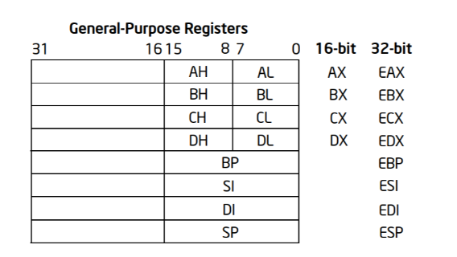
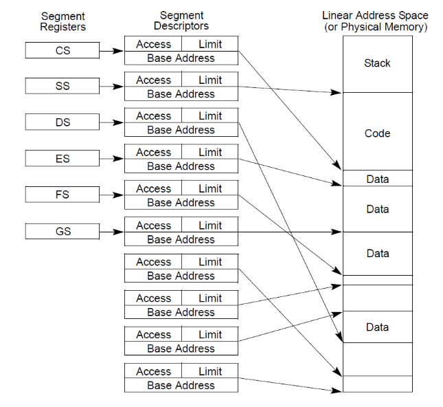
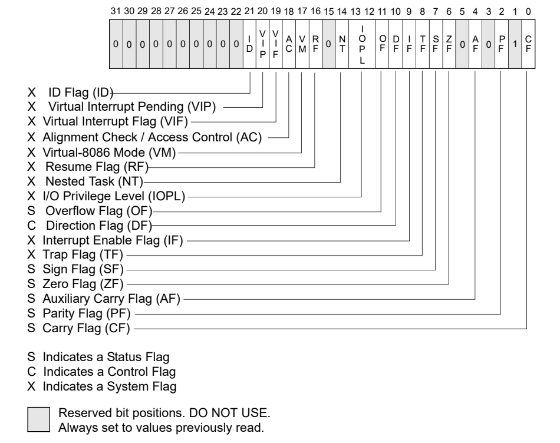

# IA-32 Register 기본 설명
{: .no_toc}

IA-32(Intel Architecture 32비트) 설명
{: .fs-6 .fw-300 }

---

1. TOC
{:toc}

---

## 실습 목표
- 애플리케이션의 디버깅을 위해 기본적으로 알아야 할 IA-32의 레지스터에 대하여 분석

---

## 1.1 CPU 레지스터란?
- CPU 레지스터는 CPU 내에서 사용되는 고속 메모리 저장소이다.
- 레지스터(Register)란 CPU 내부에 존재하는 다목적 저장 공간
- CPU가 명령을 실행하거나 데이터를 처리할 때 필요한 값을 즉시 읽고 쓸 수 있는 장소로, 일반적인 메모리(RAM)보다 훨 씬 빠르게 접근할 수 있다.

## 1.2 IA-32의 레지스터
- IA-32는 **인텔 아키텍처 32비트(Intel Architecture, 32-bit)**의 약자로, x86 아키텍처의 32비트 버전을 의미
- IA-32는 지원하는 기능도 많고 그만큼 레지스터의 수도 많다.
- 애플리케이션 디버깅의 초급 단계에서는 Basic program execution register에 대해서 알아두어야 한다.

{: .no_toc}
> - Basic program execution registers
> - x87 FPU registers
> - MMX registers
> - XMM registers
> - Control registers
> - Memory management registers
> - Debug registers
> - Memory type range registers
> - Machine specific registers
> - Machine check registers
> - ...

## 1.3 Basic program execution registers
- 해당 레지스터는 프로그램 실행과 제어에 필요한 다양한 정보를 저장하고 관리하는 CPU 내 레지스터들을 의미
- Basic program execution registers는 4개의 그룹으로 나눌 수 있다.
- General Purpose Registers (32비트 - 8개)
- Segment Registers (16비트 - 6개)
- Program Status and Control Register (32비트 - 1개)
- Instruction Pointer (32비트 - 1개)
- 

## 1.4 범용 레지스터
- 범용 레지스터(General Purpose Registers)는 여러 종류의 데이터 처리를 위한 다목적 저장 공간
- 주로 산술 연산이나 논리 연산을 수행하는 데 사용되며, 각종 데이터를 임시로 저장
- IA-32에서 각각의 범용 레지스터들의 크기는 32비트(4바이트)이다.
- 

{: .no_toc}
> - 각 레지스터들은 16비트 하위 호환을 위하여 몇 개의 구획으로 나뉜다. (EAX를 기준으로 설명)
> - EAX : (0 ~ 31) 32비트
> - AX : (0 ~ 15) EAX의 하위 16비트
> - AH : (8 ~ 15) AX의 상위 8비트
> - AL : (0 ~ 7) AX의 하위 8비트
> - 즉 4바이트(32비트)를 다 사용하고 싶을 때는 **EAX**를 사용하고, 2바이트(16비트)만을 사용할 때는 EAX의 하위 16비트 부부인 **AX**를 사용하면 된다.
> - 이런식으로 상황에 맞게 8비트, 16비트, 32비트로 알뜰하게 사용

 

- 아래 4개의 레지스터들은 주로 산술연산(ADD, SUB, XOR, OR 등) 명령어에서 상수/변수 값의 저장 용도로 많이 사용
- EAX : Accumulator for operands and results data
- EBX : Pointer to data in the DS segment
- ECX : Counter for string and loop operations
- EDX : I/O pointer

{: .no_toc}
> - 추가적으로 ECX와 CAX는 특수한 용도로도 많이 사용
> - ECX는 반복 명령문(LOOP)에서 반복 카운트(loop count)로 사용(루프를 돌 때마다 ECX를 1씩 감소시킴)
> - EAX는 일반적으로 함수 리턴 값에 사용. 모든 Win32 API 함수들은 리턴 값을 EAX에 저장한 후 리턴

 

- 나머지 범용 레지스터들의 이름은 아래와 같고, 주로 메모리 주소를 저장하는 포인터로 사용
- EBP : Pointer to data on the stack (in the SS sement)
- ESI : source pointer for string operations
- EDI : destination pointer for string operations
- ESP : Stack pointer (in the SS segment)

{: .no_toc}
> - ESP는 스택 메모리 주소를 가리킴
> - EBP는 함수가 호출되었을 때 그 순간의 ESP를 저장하고 있다가, 함수가 리턴하기 직전에 다시 ESP에 값을 되돌려줘서 스택이 깨지지 않도록 함(Stack Frame 기법)
> - ESI와 EDI는 특정 명령어들(LODS, STOS, REP MOVS 등)과 함께 주로 메모리 복사에 사용
> - LODS: 메모리에서 데이터를 가져와 레지스터로 저장.
> - STOS: 레지스터에 있는 데이터를 메모리로 저장.
> - REP MOVS: 소스 메모리에서 목적지 메모리로 다수의 데이터를 반복적으로 복사.

## 1.5 범용 레지스터 요약

| 레지스터  | 설명                                                                 |
|-----------|----------------------------------------------------------------------|
| **EAX**   | 주로 산술 연산의 결과를 저장하는 **누산기(accumulator)**로 사용 |
| **EBX**   | 데이터를 저장하는 데 사용되는 기본 레지스터                     |
| **ECX**   | 반복 연산에서 **카운터(counter)**로 사용                         |
| **EDX**   | EAX와 함께 곱셈, 나눗셈 연산 등에서 보조적으로 사용              |
| **ESI/EDI** | 문자열 연산이나 메모리 주소 계산에 자주 사용                     |
| **EBP/ESP** | 스택 포인터와 관련된 작업을 처리. 함수 호출 시 스택에 데이터를 저장하고, 스택의 최상단을 추적하는 데 사용. |

---

## 2.1 세그먼트 레지스터
- IA-32 보호 모드에서 세그먼트란 메모리를 조각내어 각 조각마다 시작 주소, 범위, 접근 권한 등을 부여해서 메모리를 보호하는 기법
- 세그먼트는 페이징(Paging) 기법과 함께 가상 메모리를 실제 물리 메모리로 변경할 때 사용
- 세그먼트 레지스터는 총 6개(CS, SS, DS, ES, FS, GS)이며 각각의 크기는 16비트(2바이트)이다.
- 

{: .no_toc}
> - 세그먼트 레지스터가 가리키는 세그먼트 디스크립터(Segment Descriptor)와 가상 메모리가 조합되어 선형주소(Linear Address)가 되며, 페이징 기법에 의해서 선형 주소가 최종적으로 물리주소(Physical Address)로 변환
> - **페이징 기법**은 운영체제에서 가상 메모리와 물리적 메모리를 효율적으로 관리하기 위한 메모리 관리 기법

 

- 각 세그먼트 레지스터의 이름은 아래와 같다.
- CS : Code Segment
- SS : Stack Segment
- DS : Data Segment
- ES : Extra(Data) Segment
- FS : Data Segment
- GS : Data Segment

---

## 3.1 프로그램 상태와 컨트롤 레지스터
- 플래그(Flag) 레지스터의 이름은 EFLAGS이며 32비트(4바이트) 크기이다.
- EFLAGS 레지스터는 각각의 비트마다 의미를 가지고 있는데, 각 비트는 1 또는 0 의 값을 가진다.
- 이는 On/Off 혹은 True/False를 의미한다. 일부 비트는 시스템에서 직접 세팅학, 일부 비트는 프로그램에서 사용된 명령의 수행 결과에 따라 세팅된다.

{: .no_toc}
> - EFLAGS 레지스터의 32개의 각 비트 의미를 전부 이해한다는 것은 상당히 어려운 일
> - 리버싱 입문 단계에서는 애플리케이션 디버깅에 필요한 3가지 flag(ZF, OF, CF)에 대해서만 이해하면 된다.

- 

 

- Zero Flag(ZF) : 연산 명령 후에 결과 값이 0이 되면 ZF가 1(True)로 세팅
- Overflow Flag(OF) : 부호 있는 수(signed integer)의 오버플로가 발생했을 때 1로 세팅, 그리고 MSB(Most Significant Bit)가 변경되었을 때 1로 세팅
- Carry Flag(CF) : 부호 없는 수(unsigned integer)의 오버플로가 발생했을 때 1로 세팅

---

## 4.1 Instruction Pointer
- EIP : Instruction Pointer
- EIP는 CPU가 처리할 명령어의 주소를 나타내는 레지스터
- 크기는 32비트(4바이트)이고, CPU는 EIP에 저장된 메모리 주소의 명령어를 하나 처리하고 난 후 자동으로 그 명령어 길이만큼 EIP를 증가시킴
- 범용 레지스터들과는 다르게 EIP는 그 값을 직접 변경할 수 없도록 되어 있어서 다른 명령어를 통하여 간접적으로 변경
- EIP를 변경하고 싶을 때는 특정 명령어(JMP, Jcc, CALL, RET)를 사용하거나 인터럽트(interrupt), 예외(exception)를 발생시켜야 한다.

---

> [OllyDbg](https://www.ollydbg.de/)

