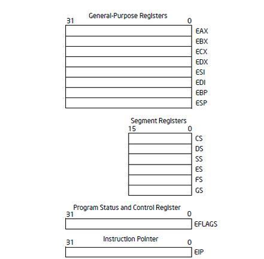

# Stack 기본 설명
{: .no_toc}

IA-32(Intel Architecture 32비트) 설명
{: .fs-6 .fw-300 }

---

1. TOC
{:toc}

---

## 실습 목표
- 스택 메모리와 구조에 대하여 분석

---

## 1.1 스택의 역할
- 함수 내의 로컬 변수 임시 저장
- 함수 호출 시 파라미터 전달
- 복귀 주소(return address) 저장

## 1.2 IA-32의 레지스터
- IA-32는 **인텔 아키텍처 32비트(Intel Architecture, 32-bit)**의 약자로, x86 아키텍처의 32비트 버전을 의미
- IA-32는 지원하는 기능도 많고 그만큼 레지스터의 수도 많다.
- 애플리케이션 디버깅의 초급 단계에서는 Basic program execution register에 대해서 알아두어야 한다.

{: .no_toc}
> - Basic program execution registers
> - x87 FPU registers
> - MMX registers
> - XMM registers
> - Control registers
> - Memory management registers
> - Debug registers
> - Memory type range registers
> - Machine specific registers
> - Machine check registers
> - ...

## 1.3 Basic program execution registers
- 해당 레지스터는 프로그램 실행과 제어에 필요한 다양한 정보를 저장하고 관리하는 CPU 내 레지스터들을 의미
- Basic program execution registers는 4개의 그룹으로 나눌 수 있다.
- General Purpose Registers (32비트 - 8개)
- Segment Registers (16비트 - 6개)
- Program Status and Control Register (32비트 - 1개)
- Instruction Pointer (32비트 - 1개)
- 

---

> [OllyDbg](https://www.ollydbg.de/)

