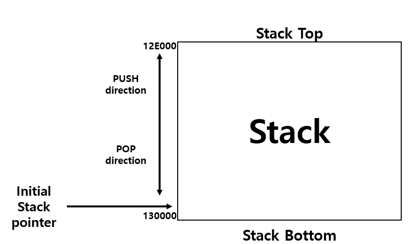
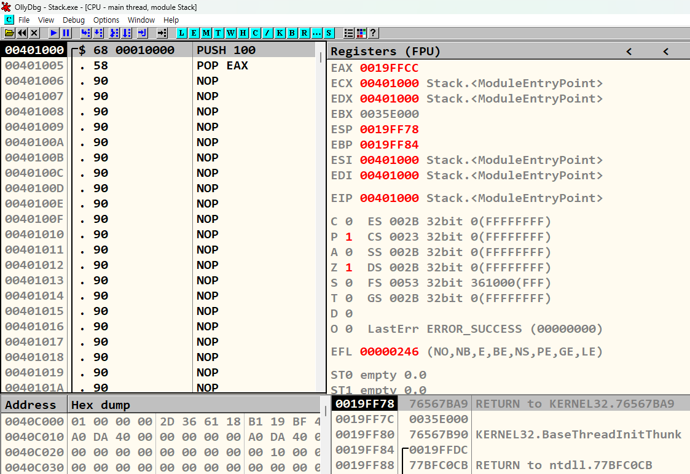

# Stack 기본 설명
{: .no_toc}

스택의 동작 원리에 대해 설명 및 실습
{: .fs-6 .fw-300 }

---

1. TOC
{:toc}

---

## 실습 목표
- 스택 메모리와 구조에 대하여 분석

---

## 1.1 스택의 역할
- 함수 내의 로컬 변수 임시 저장
- 함수 호출 시 파라미터 전달
- 복귀 주소(return address) 저장
- 위와 같은 역할을 수행하기에는 스택의 FILO(First In Last Out)구조가 아주 유용

## 1.2 스택의 특징
- 프로세스에서 스택 포인터(ESP)의 초기 값은 Stack Bottom쪽에 가깝다.
- PUSH 명령에 의해서 Stack에 값이 추가되면 스택 포이터는 Stack Top을 향해 움직임.
- POP 명령에 의해 스택에서 값이 제거되면 스택 포인터는 Stack Bottom을 향해 움직임.
- 즉 높은 주소에서 낮은 주소 방향으로 스택이 자라남.
- 

---

## 2.1 스택 동작 예제
- 초기 상태의 스택
- 스택 포인터(ESP)의 값은 19FF78
- 

{: .no_toc}
> - 

---

> [OllyDbg](https://www.ollydbg.de/)

