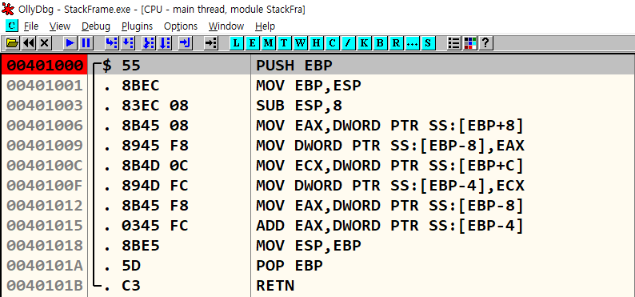

# Stack Frame 기본 설명
{: .no_toc}

스택 프레임의 동작 원리를 이해
{: .fs-6 .fw-300 }

---

1. TOC
{:toc}

---

## 실습 목표
- 간단한 프로그램을 만들고 디버거를 이용해서 스택 프레임을 확인
- 간단한 어셈블리 명령어의 상세 설명

---

## 1.1 스택 프레임이란
- ESP(스택 포인터)가 아닌 EBP(베이스 포인터)레지스터를 사용하여 스택 내의 로컬 변수, 파라미터, 복귀 주소에 접근하는 기법
- ESP 레지스터가 스택 포인터 역할
- EBP 레지스터는 베이스 포인터 역할

{: .no_toc}
> - ESP 레지스터의 값은 프로그램 안에서 수시로 변경되기 때문에 스택에 저장된 변수, 파라미터에 접근하고자 할 때 ESP 값을 기준으로 하면 프로그램을 만들기 어려움
> - 따라서 어떤 기준 시점(함수 시작)의 ESP 값을 EBP에 저장하고 이를 함수 내에서 유지해주면, ESP 값이 아무리 변하더라도 EBP를 기준(base)으로 안전하게 해당 함수의 변수, 파라미터, 복귀 주소에 접근 가능

---

## 2.1 실습 예제 - stackframe.exe
- 스택 프레임의 설명을 위해 아주 간단한 프로그램을 만들어 실습
- StackFrame.cpp

```cpp
#include "stdio.h"

long add(long a, long b)
{
	long x = a, y = b;
	return (x + y);
}

int main(int argc, char* argv[])
{
	long a = 1, b = 2;
	printf("%d\n", add(a, b));
	return 0;
}

// 출력 값
// 3
```

<br>

- OllyDbg로 StackFrame.exe 파일을 열고 401000 주소로 이동
- 원본 C 소스코드와 그에 대응되는 어셈블리 코드를 하나씩 살펴보고 각 단계별로 스택의 모습을 이해
- 

## 2.2 main() 함수 시작 & 스택 프레임 생성
- StackFrame.cpp에서 아래 코드 부분에 해당되는 내용

```cpp
int main(int argc, char* argv[])
{
```

<br>

- 먼저 main() 함수(401020)에 BP를 설치한 후, 실행
- main() 함수 시작 시 스택의 상태는 ESP = 19FF2C, EBP = 19FF70
- 특히 ESP에 저장된 값 401250은 main() 함수의 실행이 끝난 후 돌아갈 리턴 주소
- 

<br>

- **00401020 PUSH EBP ; # main()**
- main() 함수는 시작하자마자 스택 프레임을 생성
- main() 함수에서 EBP가 베이스 포인터의 역할을 하게 될 테니 EBP가 이전에 가지고 있던 값을 스택에 백업해두기 위한 용도로 사용
- 나중에 main() 함수가 종료(리턴)되기 전에 이 값을 복구

- **00401021 MOV EBP, ESP**
- ESP의 값을 EBP로 이동, 즉 이 명령 이후부터 EBP는 현재 ESP와 같은 값을 가짐
- main() 함수 끝날 때까지는 EBP 값은 고정
- 스택에 저장된 함수 파라미터와 로컬 변수들은 EBP를 통해 접근(Access)하겠다는 의미를 가짐
- **401020, 401021** 주소의 두 명령어에 의해서 main() 함수에 대한 스택 프레임이 생성 (EBP가 세팅되었다고 말함)

- 여기까지 실행 후 스택의 상태 확인, OllyDbg의 스택 창을 선택한 후 마우스 우측 메뉴에서 Address - Relative to EBP 를 선택
- 

- EBP 값은 19FF28으로 ESP와 동일하고, 19FF28 주소에는 19FF70 이라는 값이 저장되어 있음
- 19FF70은 main() 함수 시작할 때 EBP가 가지고 있던 초기 값
- 

## 2.3 로컬 변수 세팅

---

{: .no_toc}
> - 스택에 값을 입력하면 스택 포인터(ESP)는 감소
> - 스택에서 값을 꺼내면 스택 포인터는 증가
> - 스택 포인터의 초기 값은 스택 메모리의 아래쪽에 있다는 특징이 있음


---

> [OllyDbg](https://www.ollydbg.de/)


