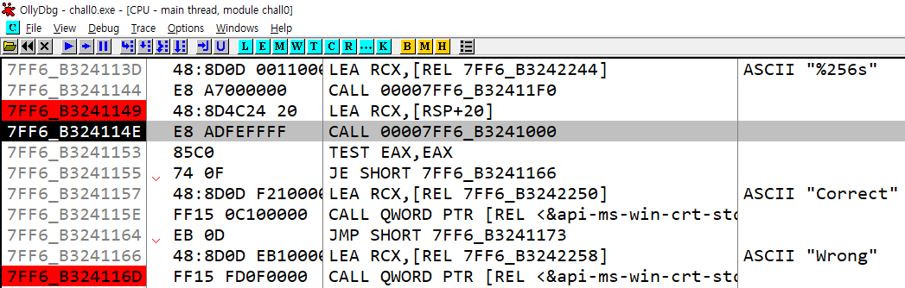

# Wargame - 01
{: .no_toc}

Reversing Basic Challenge #0
{: .fs-6 .fw-300 }

[Dreanhack][dreamhack]{: .btn .fs-5 .mb-4 .mb-md-0 target="_blank"}

---

1. TOC
{:toc}

---

## 문제
- 사용자에게 문자열 입력을 받아 정해진 방법으로 입력값을 검증하여 correct 또는 wrong을 출력하는 프로그램이 주어집니다.
- 해당 바이너리를 분석하여 correct를 출력하는 입력값을 찾으세요!

## 도구
- OllyDbg 64-bit

{: .no_toc}
> - 디버깅 작업을 여러 날에 걸쳐 진행한 관계로, 메모리 주소 값이 이전 작업과 달라질 수 있습니다.
> - 디버깅 도구를 사용하여 프로그램을 분석할 때, 재실행 시 메모리 주소가 재배치되거나 변동될 수 있는 점을 감안 부탁드립니다.

---

## 1.1 문제 해결 전략 
- 디버깅 시작 전 프로그램 파일을 실행시켜 확인
- 사용자에게 문자열 입력을 받는 함수의 주소 확인
- 입력받는 문자열 저장 주소 확인
- Wrong, Correct 출력 함수 확인
- Wrong, Correct 출력 함수 디버깅
- Wrong, Correct 조건문 함수 확인
- Wrong 출력 확인
- Correct 입력값 도출

---

## 2.1 프로그램 파일 실행
- 먼저 **OllyDbg**를 사용하여 프로그램을 실행
- 프로그램 파일을 실행하여 기본 동작을 확인
- 프로그램이 시작되면 사용자 입력을 받기 위해 Input() 함수를 호출
- 사용자가 값을 입력한 후, "Wrong" 메시지가 출력
- 

## 2.2 사용자에게 문자열 입력을 받는 함수의 주소 확인
- 프로그램을 재디버깅 하여 시작주소로 이동
- 

## 2.3 입력받는 문자열 저장 주소 확인
- Step Over`[F8]` 명령어를 사용해 CMD 창에서 Input 함수가 호출될 때까지 디버깅을 진행.
- Input 함수가 실행되었으나 입력이 불가능한 상태였으며, 입력이 가능할 때까지 디버깅(`[F8]`)을 계속 진행.
- SYSCALL 명령어가 실행된 후에 사용자 입력이 가능해졌고, 입력 후 디버깅을 계속 진행
- 

## 2.4 Wrong, Correct 출력 함수 확인
- Step Over 명령어로 디버깅을 진행 중, Correct, Wrong 문자열을 발견
- 해당 어셈블리 코드 확인
- `CALL 00007FF7_72A21000` : `7FF7_72A21000` 주소의 함수를 호출
- `LEA, RCX, [RSP+20]` : **현재 스택 포인터(RSP)**에 **0x20(32 바이트)**를 더한 메모리 주소를 **RCX**에 저장
- `TEST EAX, EAX` : 비트 AND 연산을 수행하여 EAX 레지스터의 값을 검사
- `JE SHORT 7FF7_72A21000` : 위의 TEST 결과가 0이면 ZF(Zero Flag) 플래그가 설정되어 있는 메모리 주소(`7FF7_72A21000`)로 이동
- 

{: .no_toc}
> - RSP : 스택 포인터를 의미하며, 현재 스택의 최상단
> - RCX : 일반적인 연산에서 데이터를 임시로 저장하거나 값을 계산하는 데 사용할 수 있는 범용 레지스터
> - [RSP+20] : 스택에서 RSP + 0x20(32바이트) 위치에 있는 데이터
> - TEST는 EAX와 EAX를 테스트하는 것이므로, EAX 값 자체가 0인지 여부를 검사
> - EAX == 0 : ZF(Zero Flag)가 설정
> - EAX != 0 : ZF가 클리어
> - TEST 결과에 따라 JE 결과가 0이 아니면 ZF 플래그가 클리어되어 JE 명령어를 무시,
> - 결과가 0이면 JE가 지정된 메모리 주소로 이동

## 추가 설명 : TEST EAX 결과를 통한 Correct/Wrong 출력 확인
- `TEST EAX, EAX` 결과에 따라 "Correct", "Wrong"이 출력
- 따라서 `CALL 00007FF7_72A21000` 에서 EAX 값이 결정
- Step Into(`[F7]`) 명령어를 사용해 `CALL 00007FF7_72A21000` 명령어가 호출하는 해당 메모리 주소로 이동
- 

## 2.5 Wrong, Correct 조건문 함수 확인
- 해당 어셈블리 코드 확인
- `MOV QWORD PTR [RSP+8], RCX` : RCX에 저장된 64비트 값을 [RSP+8] 스택에 저장
- 현재 RCX 범용 레지스터에는 사용자가 입력한 'TEST' 문자열이 저장되어 있음
- `LEA RDX, [REL 7FF6_631B2220]` : **Compar3_the_str1ng**(`7FF6_631B2220`)를 RDX에 저장
- `MOV RCX, QWORD PTR [RPS+40]` : RSP + 0x40 위치에 있는 64비트 데이터를 읽고, RCX에 저장
- 

{: .no_toc}
> - MOV : 데이터를 복사하는 명령어
> - RDX : 64비트 범용 레지스터
> - REL : 상대 주소(Relative Address)를 의미, 현재 명령어의 위치를 기준으로 한 상대적인 메모리 주소
> - PTR : 특정 크기의 데이터를 처리할 때 사용, 이는 메모리에서 읽거나 쓸 데이터의 크기를 결정하는 데 중요
> - BYTE PTR : 1바이트(8비트) 크기의 데이터
> - WORD PTR : 2바이트(16비트) 크기의 데이터
> - DWORD PTR : 4바이트(32비트) 크기의 데이터
> - QWORD PTR : 8바이트(64비트) 크기의 데이터

## 2.5 Wrong, Correct 출력 함수 디버깅
- 아래에 `CALL <JMP.&api-ms-win-crt-string-l1-1-0.strcmp>` 명령어 확인
- `CALL <JMP.&api-ms-win-crt-string-l1-1-0.strcmp>` : C 라이브러리의 strcmp 함수를 호출하는 명령어
- strcmp 함수 호출, 이 호출에서 RCX에는 첫 번째 문자열("TEST")의 주소가, RDX에는 두 번째 문자열("Compar3_the_str1ng")의 주소가 전달
- strcmp 함수의 결과, EAX 레지스터에 반환 (strcmp는 문자열이 같으면 0, 그렇지 않으면 양수 또는 음수를 반환)
- Step Over 명령어를 사용해 `CALL <JMP.&api-ms-win-crt-string-l1-1-0.strcmp>` 명령어 실행
- `TEST EAX, EAX` : CALL 명령어 결과로, 1이 반환
- `JNE SHORT 7FF6_03D11028` : TEST의 비교 결과가 0이 아니므로, `7FF6_03D11028` 주소로 점프
- 

{: .no_toc}
> - JE (Jump if Equal): Zero Flag가 설정된 경우 점프. 즉, 비교 결과가 0이면 점프
> - JNE (Jump if Not Equal): Zero Flag가 클리어된 경우 점프. 즉, 비교 결과가 0이 아니면 점프
> - strcmp 함수 예시
> 
> ```c
> #include <stdio.h>
> #include <string.h>
> 
> int main() {
> 	char str1[] = "shw";
> 	char str2[] = "0331";
> 	char str3[] = "shw";
> 
> 	int result1 = strcmp(str1, str2);
> 	int result2 = strcmp(str2, str3);
> 	int result3 = strcmp(str1, str3);
> 
> 	printf("result1 : %d \n", result1);
> 	printf("result2 : %d \n", result2);
> 	printf("result3 : %d \n", result3);
> 
> 	return 0;
> }
> // 출력값 (사전순으로 뒤에 있으면 1, 사전순으로 앞에 있으면 -1, 같으면 0)
> // result1 : 1
> // result2 : -1
> // result3 : 0
> ```

<br>

- 해당 `7FF6_03D11028` 주소로 이동
- `MOV DWORD PTR [RSP+20], 0` : [RSP+20]에 0을 저장
- `MOV EAX, DWORD PTR [RSP+20]` : [RSP+20]에 저장된 값을 EAX에 저장, EAX는 0
- `RETN` : 종료

## 2.6 Wrong 출력 확인
- `CALL 00007FF6_631B1000` 함수 종료
- `CALL 00007FF6_631B1000` 함수에 의해서 EAX값 0을 반환
- `TEST EAX, EAX` : TEST 결과 값은 0
- `JE SHORT 7FF6_631B1166` : TEST 결과에 따라 Zero Flag가 설정, 따라서 해당 주소(`7FF6_631B1166`)로 점프
- 

<br>

- 해당 어셈블리 코드 확인
- `LEA RCX, [REL 7FF6_631B2258]` : RCX 레지스터에 `7FF6_631B2258` 메모리 주소를 저장 (**Wrong**)
- `CALL QWORD PTR [REL <&api-ms-win-crt-stdio-l1-1-0.puts>]` : puts 함수를 호출하여 RCX에 저장된 문자열을 출력.
- CMD 창에 **Wrong** 출력
- 

{: .no_toc}
> - `puts` 함수는 C 표준 라이브러리의 함수로, 주로 문자열을 콘솔에 출력하는 데 사용
> - `puts` 함수는 전달받은 문자열을 출력한 후 자동으로 줄바꿈(`\n`) 문자를 추가
>
> ```c
> // 예시 코드
> #include <stdio.h> 
> 
> int main() {
>     puts("Hello, world!");
>     return 0;
> }
> ```

## 2.7 Correct 입력값 도출
- 2.5 목차 분석에서, RCX에 저장된 문자열 "**TEST**"와 RDX에 저장된 "**Compar3_the_str1ng**" 문자열을 비교하는 알고리즘 확인
- 결과적으로, RDX에 저장된 "Compar3_the_str1ng"을 입력하면, `CALL 00007FF6_631B1000` 함수의 결과로 EAX가 1을 반환하여 Correct 함수 주소로 이동할 것으로 추측
- 

<br>

- 재디버깅 후 해당 문자열(**Compar3_the_str1ng**)을 입력하여 테스트 확인
- EAX 값이 1로 반환되고, Zero Flag가 클리어되어 `JE SHORT 7FF6_631B1166` 명령어로 인해 Correct 출력 함수로 이동
- 

## 추가 설명

{: .no_toc}
> - RCX : 000000A0_FE35FB10 (ASCII "TEST")
> - CL(RCX의 하위 8비트) : 0x10(이진수 : 0001 0000)
> - 07 : 0x07 (이진수: 0000 0111)
> - 따라서 CL, 07 AND 연산 결과 **0000 0000**, 즉 Zero Flag가 실행

{: .no_toc}
> - EAX는 RAX의 하위 32비트이므로, EAX 값은 B3242220 이다.
> - CMP destination, source : 두 값을 비교하는 어셈블리 명령어, 결과는 버리고 오직 플래그만 갱신
> - destination < source: CF = 1 (설정됨, 빌림 발생)
> - destination ≥ source: CF = 0 (클리어됨, 빌림 없음)
> - destination == source: ZF = 1 (설정됨, 값이 같음)
> - destination ≠ source: ZF = 0 (클리어됨, 값이 다름)
> - destination < source (부호 있는 연산에서 음수): SF = 1 (설정됨, 음수 결과)
> - destination ≥ source (부호 있는 연산에서 양수 또는 0): SF = 0 (클리어됨, 양수 결과)

{: .no_toc}
> - SBB RAX, RAX는 이전 명령어의 CF 값에 의존
> - CF = 0이면: RAX = RAX - RAX - 0 = 0
> - CF = 1이면: RAX = RAX - RAX - 1 = -1
> - JNE : Zero Flag가 클리어된 경우에만 점프

---

---

[dreamhack]: https://dreamhack.io/wargame/challenges/14