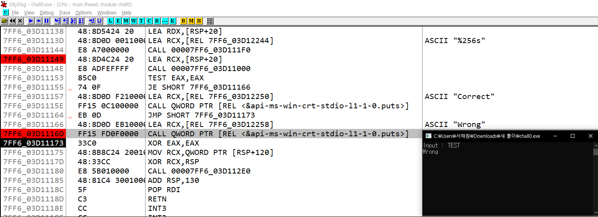

# Wargame - 01
{: .no_toc}

Reversing Basic Challenge #0
{: .fs-6 .fw-300 }

[Dreanhack][dreamhack]{: .btn .fs-5 .mb-4 .mb-md-0 target="_blank"}

---

1. TOC
{:toc}

---

## 문제
- 사용자에게 문자열 입력을 받아 정해진 방법으로 입력값을 검증하여 correct 또는 wrong을 출력하는 프로그램이 주어집니다.
- 해당 바이너리를 분석하여 correct를 출력하는 입력값을 찾으세요!

## 도구
- OllyDbg 64-bit

---

## 1.1 문제 해결 전략 
- 디버깅 시작 전 프로그램 파일을 실행시켜 확인
- 사용자에게 문자열 입력을 받는 함수의 주소 확인
- 입력받는 문자열 저장 주소 확인
- Wrong, Correct 출력 함수 확인
- Wrong, Correct 출력 함수 디버깅
- Wrong, Correct 조건문 함수 확인
- Correct 입력값 도출

---
## 2.0 프로그램 파일 실행
- 프로그램 파일을 실행하여 기본 동작을 확인
- 프로그램이 시자되면 사용자 입력을 받기 위해 Input() 함수를 호출
- 사용자가 값을 입력한 후, "Wrong" 메시지가 출력
- 

## 2.1 사용자에게 문자열 입력을 받는 함수의 주소 확인
- 먼저 **OllyDbg**를 사용하여 프로그램을 실행
- 

<br>

- Step Over`[F8]` 명령어를 사용해 CMD 창에서 Input 함수가 호출될 때까지 디버깅을 진행.
- **CALL 00007FFB_6DF79B2C** : Input 함수와 관련된 주소인 7FFB_6DF79B2C를 확인.
- 


## 2.2 입력받는 문자열 저장 주소 확인
- Input 함수가 실행되었으나 입력이 불가능한 상태였으며, 입력이 가능할 때까지 디버깅(`[F8]`)을 계속 진행.
- SYSCALL 명령어가 실행된 후에 사용자 입력이 가능해졌고, 입력 후 디버깅을 계속 진행
- 

## 2.3 Wrong, Correct 출력 함수 확인
- 디버깅을 계속 진행 하다가, 7FF6_03D11149 주소로 이동
- 아래 **Correct**, **Wrong** ASCII 문자열을 확인
- 

## 2.4 Wrong, Correct 출력 함수 디버깅
- 해당 어셈블리 코드 확인
- `LEA, RCX, [RSP+20]` : **현재 스택 포인터(RSP)**에 **0x20(32 바이트)**를 더한 메모리 주소를 **RCX**에 저장
- Step Into(`[F7]`) 명령어를 사용해 CALL 7FF6_03D11000 명령어가 호출하는 해당 메모리 주소로 이동

{: .no_toc}
> - RSP : 스택 포인터를 의미하며, 현재 스택의 최상단
> - RCX : 일반적인 연산에서 데이터를 임시로 저장하거나 값을 계산하는 데 사용할 수 있는 범용 레지스터
> - [RSP+20] : 스택에서 RSP + 0x20(32바이트) 위치에 있는 데이터

```asm
Address          Hex dump        Command                                    Comments
7FF6_03D11149    48:8D4C24 20    LEA RCX,[RSP+20]
7FF6_03D1114E    E8 ADFEFFFF     CALL 00007FF6_03D11000
7FF6_03D11153    85C0            TEST EAX,EAX
7FF6_03D11155    74 0F           JE SHORT 7FF6_03D11166
7FF6_03D11157    48:8D0D F210000 LEA RCX,[REL 7FF6_03D12250]              ; ASCII "Correct"
7FF6_03D1115E    FF15 0C100000   CALL QWORD PTR [REL <&api-ms-win-crt-stdio-l1-1-0.puts>]
7FF6_03D11164    EB 0D           JMP SHORT 7FF6_03D11173
7FF6_03D11166    48:8D0D EB10000 LEA RCX,[REL 7FF6_03D12258]              ; ASCII "Wrong"
7FF6_03D1116D    FF15 FD0F0000   CALL QWORD PTR [REL <&api-ms-win-crt-stdio-l1-1-0.puts>]
7FF6_03D11173    33C0            XOR EAX,EAX
7FF6_03D11175    48:8B8C24 20010 MOV RCX,QWORD PTR [RSP+120]
7FF6_03D1117D    48:33CC         XOR RCX,RSP
7FF6_03D11180    E8 5B010000     CALL 00007FF6_03D112E0
7FF6_03D11185    48:81C4 3001000 ADD RSP,130
7FF6_03D1118C    5F              POP RDI
7FF6_03D1118D    C3              RETN
```

<br>

- `MOV QWORD PTR [RSP+8], RCX` : RCX에 저장된 64비트 값을 [RSP+8] 스택에 저장
- `LEA RDX, [REL 7FF6_03D12220]` : **Compar3_the_str1ng**(7FF6_03D12220)를 RDX에 저장
- `MOV RCX, QWORD PTR [RPS+40]` : RSP + 0x40 위치에 있는 64비트 데이터를 읽고, RCX에 저장
- 

{: .no_toc}
> - MOV : 데이터를 복사하는 명령어
> - RDX : 64비트 범용 레지스터
> - REL : 상대 주소(Relative Address)를 의미, 현재 명령어의 위치를 기준으로 한 상대적인 메모리 주소
> - PTR : 특정 크기의 데이터를 처리할 때 사용, 이는 메모리에서 읽거나 쓸 데이터의 크기를 결정하는 데 중요
> - BYTE PTR : 1바이트(8비트) 크기의 데이터
> - WORD PTR : 2바이트(16비트) 크기의 데이터
> - DWORD PTR : 4바이트(32비트) 크기의 데이터
> - QWORD PTR : 8바이트(64비트) 크기의 데이터

<br>

- Step Into 명령어를 사용해 CALL <JMP.&api-ms-win-crt-string-l1-1-0.strcmp> 명령어 실행
- **<JMP.&api-ms-win-crt-string-l1-1-0.strcmp>**는 문자열 비교 함수인 `strcmp`를 호출하는 명령어
- CALL 00007FF6_03D11166 함수에서 빠져나옴
- Step Over 명령어를 사용하여 디버깅을 계속함.
- 00007FF6_03D11173 주소에서 "Wrong" 문자열이 출력됨.
- 

{: .no_toc}
> - strcmp 함수 예시
> ```c
> #include <stdio.h>
> #include <string.h>
> 
> int main() {
> 	char str1[] = "shw";
> 	char str2[] = "0331";
> 	char str3[] = "shw";
> 
> 	int result1 = strcmp(str1, str2);
> 	int result2 = strcmp(str2, str3);
> 	int result3 = strcmp(str1, str3);
> 
> 	printf("result1 : %d \n", result1);
> 	printf("result2 : %d \n", result2);
> 	printf("result3 : %d \n", result3);
> 
> 	return 0;
> }
> 
> // 출력값 (사전순으로 뒤에 있으면 1, 사전순으로 앞에 있으면 -1, 같으면 0)
> // result1 : 1
> // result2 : -1
> // result3 : 0
> ```

---

---

[dreamhack]: https://dreamhack.io/wargame/challenges/14